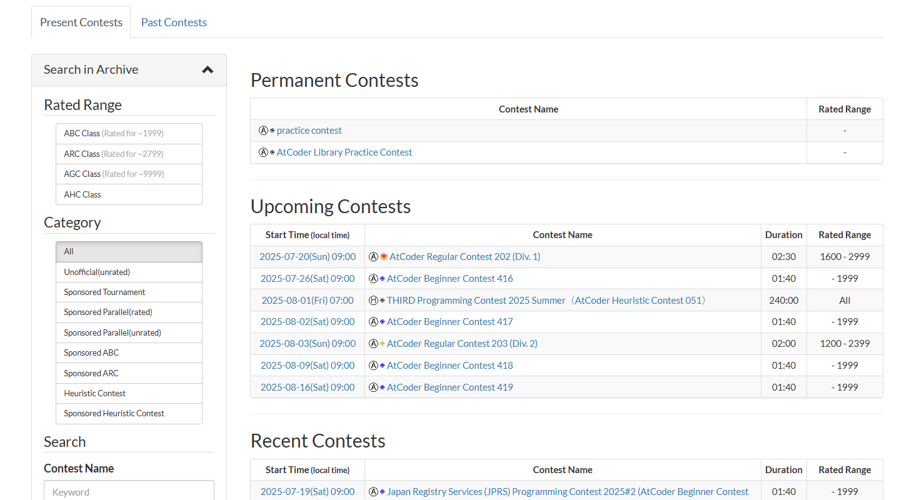
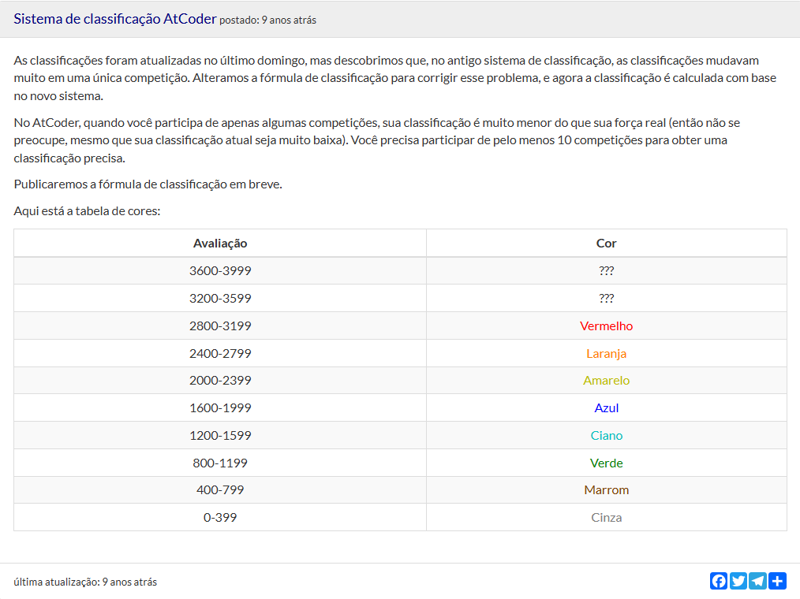
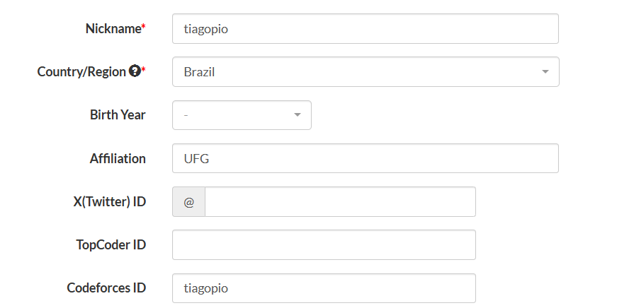
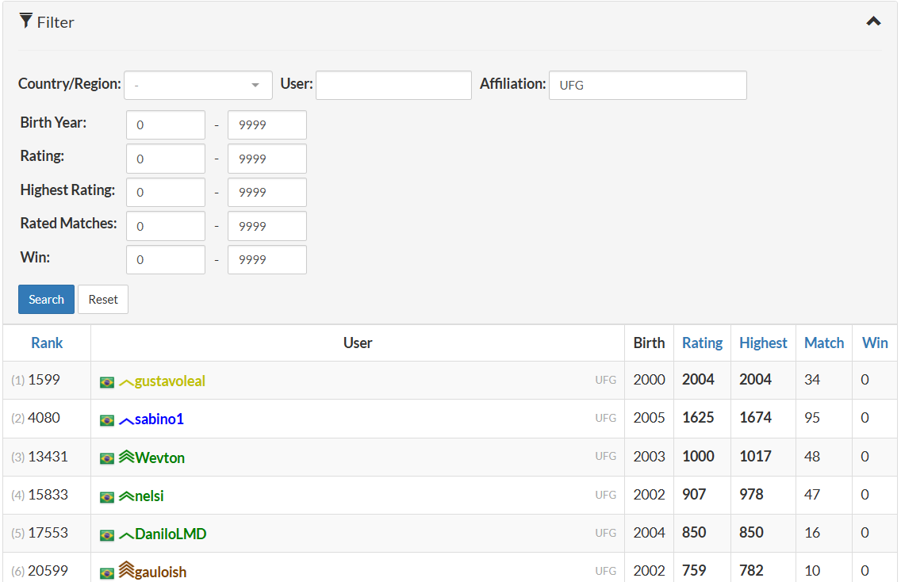

# AtCoder

<figure markdown="span">
  { width="1000" }
</figure>

O <a href="https://atcoder.jp/" target="_blank">**AtCoder**</a>  é um site japonês focado em programação competitiva, sendo considerado uma das principais plataformas da área no mundo.

---

## Tipos de Competições

O AtCoder organiza três tipos principais de competições semanais:

* **Beginner Contest (ABC):** Voltado para iniciantes, é ideal para praticar os fundamentos de algoritmos e estruturas de dados.
* **Regular Contest (ARC):** De dificuldade intermediária, é indicado para quem já possui alguma experiência em competições de programação.
* **Grand Contest (AGC):** É o mais desafiador dos três e geralmente inclui problemas complexos que exigem criatividade e o domínio de técnicas avançadas.

Essas competições são abertas, cronometradas e possuem um ranking oficial, o que contribui para a reputação do usuário dentro da comunidade.

Você pode encontrar todas as competições passadas do AtCoder na aba de *contests*:

<a href="https://atcoder.jp/contests/" target="_blank">https://atcoder.jp/contests/</a>

<figure markdown="span">
  { width="1000" }
</figure>

---

## Sistema de Pontuação e Ranqueamento

Cada usuário possui um **rating**, uma pontuação que varia conforme o desempenho nas competições. Esse sistema permite que você acompanhe seu progresso e se compare com outros competidores ao redor do mundo.

<figure markdown="span">
  { width="1000" }
</figure>

---

## Afiliação com a UFG

Após criar sua conta no AtCoder, você pode se afiliar aos competidores da UFG que também utilizam o site. Para isso, acesse as configurações gerais do seu perfil e, no campo *Affiliation*, preencha com "UFG".

<figure markdown="span">
  { width="1000" }
</figure>

Isso permite que você filtre o ranking para visualizar apenas os participantes da UFG, tanto em classificações gerais quanto durante as competições.

<figure markdown="span">
  { width="1000" }
</figure>

---

## Contests Clássicos

O AtCoder oferece *contests* clássicos focados em tópicos essenciais para competições de programação. Dois deles se destacam:

* <a href="https://atcoder.jp/contests/dp" target="_blank">**AtCoder Educational DP Contest:**</a> Um conjunto de problemas dedicado à **Programação Dinâmica**, uma das técnicas mais importantes da área.

* <a href="https://atcoder.jp/contests/practice2" target="_blank">**AtCoder Library Practice Contest:**</a> Um *contest* voltado para a prática e teste de **estruturas de dados** amplamente utilizadas.

  

Esses *contests* são excelentes recursos para aprender e validar suas implementações das técnicas e estruturas de dados mais comuns em programação competitiva.

---

## kenkoooo/atcoder

O <a href="https://kenkoooo.com/atcoder/#/table/" target="_blank">kenkoooo/atcoder</a> é uma ferramenta interativa para praticar problemas do AtCoder. Ela exibe uma tabela com todos os problemas já lançados, mostrando:

* Quais você já resolveu (marcados em verde).
* A dificuldade estimada de cada problema.
* Filtros por dificuldade, tipo de *contest* (ABC, ARC, AGC) e status (resolvido ou não resolvido).

Você pode fazer login com seu usuário do AtCoder para acompanhar seu progresso automaticamente. É uma ferramenta ideal para estudar de forma organizada e escolher problemas adequados ao seu nível de habilidade.

---