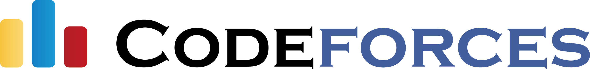
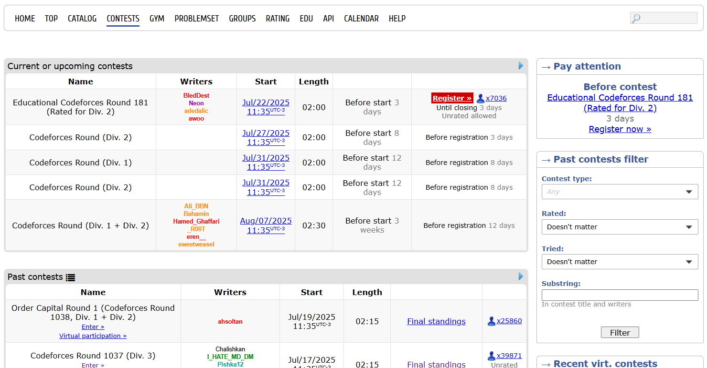
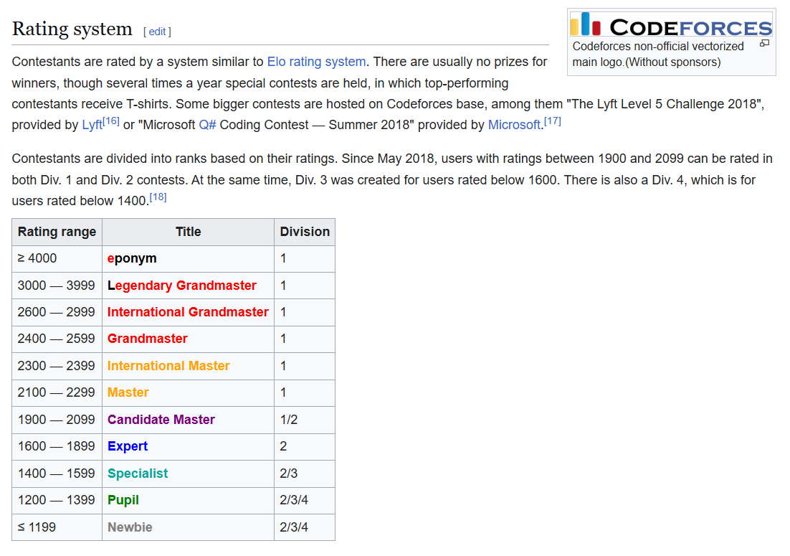
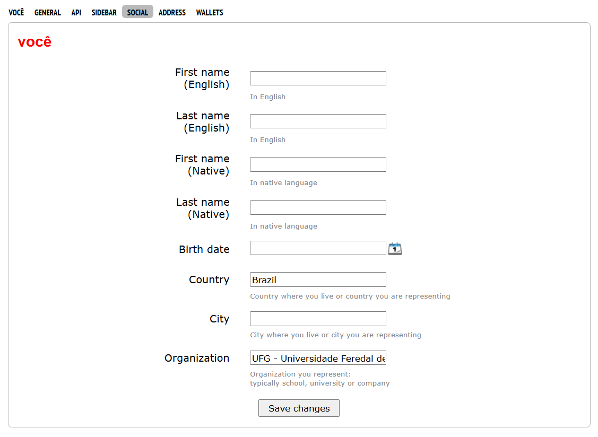
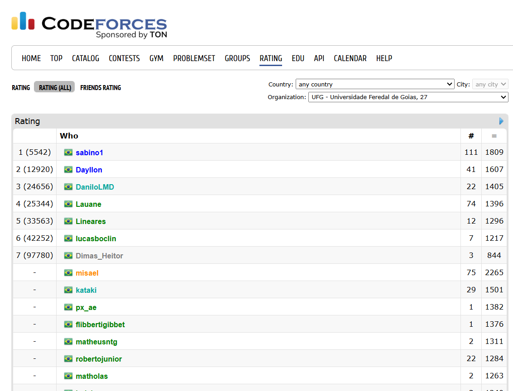
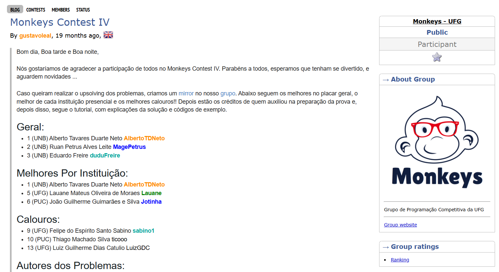
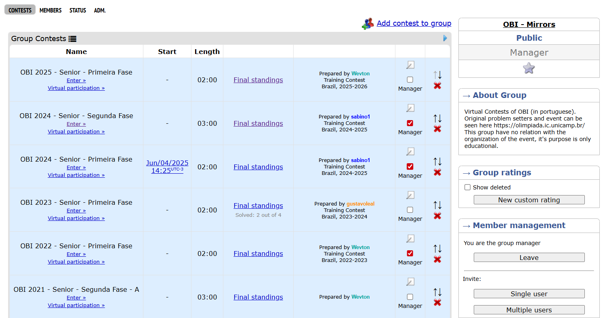
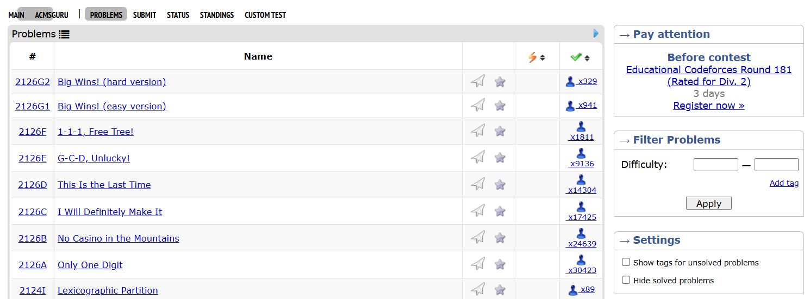
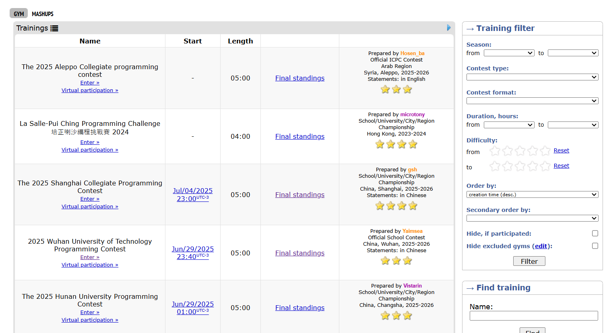
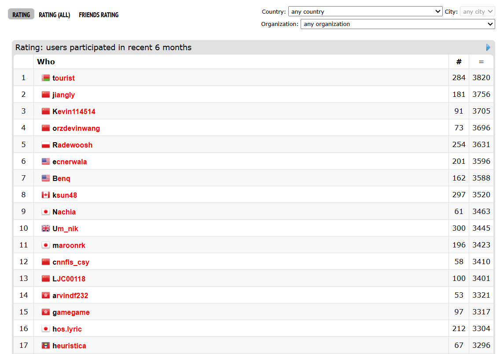

# Codeforces

<figure markdown="span">
  { width="1000" }
</figure>

O <a href="https://codeforces.com/" target="_blank">**Codeforces**</a> é um site russo focado em programação competitiva, considerado uma das principais plataformas da área no mundo.

---

## Tipos de Competições

O Codeforces organiza diversos tipos de competições, principalmente:

* **Divisional Contests (Div. 1, Div. 2, Div. 3, Div. 4):** São competições regulares divididas por nível de habilidade. A Div. 4 é para iniciantes, enquanto a Div. 1 é para os competidores mais experientes. É comum que as Divs 1 e 2 sejam combinadas (Div. 1 + Div. 2) para permitir que participantes de diferentes níveis compitam juntos em um conjunto de problemas. Quanto menor o número da divisão, maior a dificuldade.
* **Educational Rounds:** Competições que geralmente ocorrem em dias de semana, ideais para aprender e praticar novos algoritmos e estruturas de dados, com um foco mais didático.
* **Unrated Contests:** Competições onde o desempenho não afeta o *rating* do participante, servindo como uma ótima oportunidade para praticar individualmente ou em equipe, dependendo do contest.

Todas essas competições são abertas, cronometradas e contribuem para o sistema de *rating* do Codeforces, influenciando a reputação do usuário na plataforma.

Você pode encontrar todas as competições passadas e futuras do Codeforces na aba de *contests*:

<a href="https://codeforces.com/contests" target="_blank">https://codeforces.com/contests</a>

<figure markdown="span">
  { width="1000" }
</figure>

---

## Sistema de Pontuação e Ranqueamento

Cada usuário do Codeforces possui um **rating**, uma pontuação dinâmica que se ajusta a cada competição. Esse sistema permite que você acompanhe seu progresso, compare-se com outros competidores globalmente e seja classificado em diferentes "divisões" ou "cores" (e.g., Newbie, Pupil, Specialist, Expert, Candidate Master, Master, International Master, Grandmaster, International Grandmaster, Legendary Grandmaster).

<figure markdown="span">
  { width="1000" }
</figure>

---

## UFG - Universidade Feredal de Goias

No Codeforces, você pode associar sua conta à Universidade Federal de Goiás (UFG). Para fazer isso, acesse as configurações do seu perfil e, na aba social, no campo *Organization*, preencha com "UFG - Universidade **Feredal** de Goias".

<figure markdown="span">
  { width="1000" }
</figure>

Isso permite que você filtre o ranking para visualizar apenas os participantes da UFG, tanto em classificações gerais quanto durante as competições.

<figure markdown="span">
  { width="1000" }
</figure>

---

## Grupo Monkeys UFG

O Monkeys possui um grupo no Codeforces que dá acesso às nossas competições locais e treinamentos. Para entrar, basta acessar este link e participar.

<a href="https://codeforces.com/group/SmO1tpanN1" target="_blank">Grupo Monkeys no Codeforces</a>

<figure markdown="span">
  { width="1000" }
</figure>

---

## Grupo OBI - Mirrors

Também temos um grupo com provas passadas da OBI. Este grupo serve para você, participante da OBI, praticar as provas anteriores. Para entrar, basta acessar este link e participar.

<a href="https://codeforces.com/group/SFkT4V3SYb" target="_blank">Grupo OBI - Mirrors no Codeforces</a>

<figure markdown="span">
  { width="1000" }
</figure>

---

## Seções Essenciais do Codeforces

### Problemset

Aqui você encontra uma vasta coleção de **problemas de programação** de competições passadas. É o lugar perfeito para praticar, filtrar por **dificuldade** e **tópico (tags)**.

<figure markdown="span">
  { width="1000" }
</figure>

---

### Gym

O **Gym** permite criar e participar de **treinamentos personalizados** e **competições virtuais**. É ideal para equipes e grupos de estudo que querem simular competições ou focar em problemas específicos.

<figure markdown="span">
  { width="1000" }
</figure>

---

### Groups

Nesta seção, usuários podem formar **comunidades** e **equipes**, como clubes universitários ou grupos de estudo. Os grupos facilitam a organização de treinos, discussões e o acompanhamento do progresso entre os membros.

---

### Rating

Seu **Rating** é uma pontuação numérica que reflete sua habilidade em programação competitiva, ajustada a cada competição ranqueada. Ele determina sua **"cor" e "nível"** (e.g., Expert, Master).

<figure markdown="span">
  { width="1000" }
</figure>

---