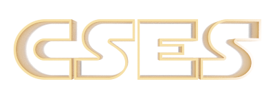

# CSES
<figure markdown="span">
    {width="1000"}
</figure>

O <a href="https://cses.fi/problemset" target="_blank">CSES</a> (Code Submission Evaluation System) é um judge finlandês com centenas de problemas relacionados a programação dos mais variados tópicos, onde os problemas tendem a ser mais clássicos, o que é perfeito para quem estiver começando na jornada de programação competitiva.

Ele separa os tópicos em várias sessões para direcionar melhor o que é necessário aprender em cada sessão. Além disso, o site possui um <a href="https://cses.fi/book/book.pdf" target="_blank">livro texto</a>. O livro é bastante interessante, pois serve como um guia para aprender a linguagem C++, usada amplamente no contexto de Programação Competitiva, e também serve como um guia para resolver os problemas dados como exercícios no site. É interessante usar o livro e os recursos apresentados nesse site para resolver os problemas propostos, mas lembre-se que o livro é apenas um guia, então há várias coisas que uma pessoa pode aprender sobre um problema se ela dedicar um tempo tentando resolvê-los antes.

O site atualmente conta com $400$ problemas diferentes, dos mais variados níveis de dificuldade, e você pode resolvê-los em qualquer ordem que desejar. Assim, se você se sentir perdido em algum problema, você pode ir para o próximo para esfriar sua cabeça do problema atual, e voltar nele depois para enfim poder resolvê-lo. É um site interessante para se aprender e é interessante dedicar um pouco do seu treinamento nas listas de problemas que ele tem a oferecer.