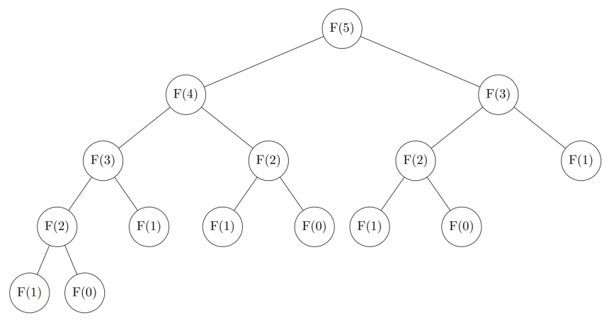

# Complexidade de Algoritmos

## Aula Relacionada recomendada:

<figure markdown="span" class="left-caption">
  <iframe width="560" height="315" src="https://www.youtube.com/embed/cu3kKbkEZSw?si=Y2Nol4FFzANIDpyo&amp;start=877" title="YouTube video player" frameborder="0" allow="accelerometer; autoplay; clipboard-write; encrypted-media; gyroscope; picture-in-picture; web-share" referrerpolicy="strict-origin-when-cross-origin" allowfullscreen></iframe>
  <figcaption>Cŕeditos: Canal Maratona UFMG.</figcaption>
</figure>


## Motivação
Pense no seguinte problema

> Dado um array de \(n\) inteiros, sua tarefa é encontrar a soma máxima dos valores em um subarray contíguo e não vazio.

> <a href="https://cses.fi/problemset/task/1643" target="_blank">CSES - Maximum Subarray Sum</a>

!!! note "Nota"
    Tente resolver o problema antes de continuar a leitura.

Em competições de programação, a eficiência dos algoritmos é crucial. Embora seja geralmente mais simples conceber uma solução funcional, o verdadeiro desafio reside em otimizá-la. Uma solução ineficiente resultará em pouca ou nenhuma pontuação.

## Análise de Complexidade
Queremos determinar o número de operações que um algoritmo executa em relação ao tamanho da entrada, \(n\). Para isso, utilizamos a <a href="https://en.wikipedia.org/wiki/Big_O_notation" target="_blank">Notação Big O</a>, que descreve o pior caso da complexidade de tempo à medida que \(n\) se aproxima do infinito. Essa notação fornece um limite superior para o número de passos que um algoritmo pode requerer, em função do tamanho da entrada.

Quando expressamos a complexidade de uma função como \(\mathcal{O}(f(n))\), geralmente omitimos fatores constantes e termos de ordem inferior de \(f(n)\). Veremos alguns exemplos práticos de como isso funciona a seguir.

## Exemplos:
### Operações constantes

O código a seguir é \(\mathcal{O}(1)\), pois executa um número constante de operações.

```cpp linenums="1"
int a;
cin >> a;
int b = 45;
int c = a + b;
cout << c << '\n';
```
Podemos assumir que operações de entrada (input) e saída (output) também são \(\mathcal{O}(1)\).

### Loops
Uma causa comum para a lentidão de um algoritmo é a quantidade excessiva de loops que processam a entrada. Quanto mais loops aninhados seu algoritmo contiver, mais lento ele será. Se houver \(k\) loops aninhados, a complexidade de tempo será \(\mathcal{O}(n^k)\).

O código a seguir tem complexidade \(\mathcal{O}(n)\):

```cpp linenums="1"
for (int i = 1; i <= n; i++) {
  // operações constantes
}
```

Como ignoramos fatores de ordem menor, o código abaixo também é \(\mathcal{O}(n)\):

```cpp linenums="1"
for (int i = 1; i <= n + 4356; i++) {
  // operações constantes
}
```
Para determinar a complexidade de loops aninhados, podemos multiplicar a complexidade de cada loop:

```cpp linenums="1"
for (int i = 1; i <= n; i++) { // O(n)
  for (int j = 1; j <= m; j++) { // O(m)
    // operações constantes
  }
}
```
Complexidade: \(\mathcal{O}(n \cdot m)\)


```cpp linenums="1"
for (int i = 1; i <= n; i++) { // O(n)
  for (int j = 1; j <= n; j++) { // O(n)
    // operações constantes
  }
}
```
Complexidade: \(\mathcal{O}(n^2)\)

Se um algoritmo possui múltiplos blocos de código, consideramos a complexidade como a pior complexidade entre todos os blocos.

```cpp linenums="1"
for (int i = 1; i <= n; i++) {
  for (int j = 1; j <= n; j++) {
    // operações constantes
  }
}

for (int i = 1; i <= n; i++) {
  // operações constantes
}
```
Complexidade: \(\mathcal{O}(n^2)\)


```cpp linenums="1"
for (int i = 1; i <= n; i++) {
  for (int j = 1; j <= n; j++) {
    // operações constantes
  }
}

for (int i = 1; i <= m; i++) {
  // operações constantes
}
```

Complexidade: \(\mathcal{O}(n^2+m)\). Isso porque o primeiro bloco tem complexidade \(\mathcal{O}(n^2)\) e o segundo tem complexidade \(\mathcal{O}(m)\), e nenhuma delas é uma função de ordem inferior em relação à outra.

### Recursão
A complexidade de uma função recursiva é determinada pelo número de vezes que a função é chamada multiplicado pela complexidade de cada chamada.

Considere a seguinte função:
```cpp linenums="1"
void f(int val, int limite) {
  if (val == limite) return;
  f(val + 1, limite);
}

int main() {
  int n;
  cin >> n;
  f(1, n);
}
```
A chamada `f(1, n)` resulta em \(n\) chamadas da função, e cada uma delas tem complexidade \(\mathcal{O}(1)\). Sendo assim, a complexidade total é \(\mathcal{O}(n)\).

Agora, vejamos a próxima função:
```cpp linenums="1" title="fibonacci.cpp"
int fib(n) {
  if (n == 0) return 0;
  if (n == 1) return 1;
  return fib(n - 1) + fib(n - 2);  
}

int main() {
  int n;
  cin >> n;
  fib(n);
}
```
Nesse caso, cada chamada da função ``fib(n)`` gera duas novas chamadas recursivas: ``fib(n - 1)`` e ``fib(n - 2)``, exceto quando atinge os casos base, que são retornados diretamente sem gerar novas chamadas.

A árvore abaixo representa visualmente essa estrutura de chamadas para ``fib(5)``

<figure markdown="span" class="graphs"> 
    
</figure>

Observe que:

- A árvore cresce para a esquerda e para a direita a cada chamada, como uma árvore binária.

- Muitos valores são recalculados diversas vezes. Por exemplo, ``fib(2)`` é chamado 3 vezes, ``fib(1)`` aparece 5 vezes.

Podemos estimar o número total de chamadas com a soma dos nós por nível:

$$ 1 + 2 + 4 + 8 + \dots + 2^{n - 1} = 2^n-1 = \mathcal{O}(2^n). $$

Ou seja, a complexidade de tempo da versão recursiva de Fibonacci é exponencial, pois o número de chamadas cresce rapidamente com \(n\).

### Complexidades Comuns e Restrições

- Fórmulas matemáticas que apenas calculam uma resposta: \(\mathcal{O}(1)\)
- Busca binária: \(\mathcal{O}(\log n)\)
- Operações em ``Set``/``Map`` ou ``Priority Queue``: \(\mathcal{O}(\log n)\) por operação
- Fatoração prima ou verificação de número primo: \(\mathcal{O}\sqrt{n}\)
- Leitura \(n \) itens de entrada: \(\mathcal{O}(n)\) 
- Iteração por um array ou lista de \(n \) elementos: \(\mathcal{O}(n)\)
- Ordenação (Sorting): Geralmente implementado em \(\mathcal{O}(n \cdot \log n)\) nas funções de ordenação da linguagem.
- Iterar por todos os subconjuntos de tamanho k de uma lista: \(\mathcal{O}(n^k)\)
- Iterar por todos os subconjuntos: \(\mathcal{O}(2^n)\)
- Iterar por todas as permutações: \(\mathcal{O}(n!)\)

Aqui estão limites superiores conservadores para o valor de \(n\) para cada complexidade de tempo.

Você pode conseguir um desempenho melhor em alguns casos, mas esta tabela te ajudará a verificar rapidamente a viabilidade de um algoritmo.


| \(n\)                      |                  Complexidades possíveis                   |
| :----------------------: | :----------------------------------------------------------: |
| \(n \leq 10\)          | \(\mathcal{O}(n!), \mathcal{O}(n^7), \mathcal{O}(n^6)\)        |
| \(n \leq 20\)          | \(\mathcal{O}(2^nn), \mathcal{O}(n^5)\)                        |
| \(n \leq 80\)          | \(\mathcal{O}(n^4)\)                                           |
| \(n \leq 400\)         | \(\mathcal{O}(n^3)\)                                           |
| \(n \leq 7500\)        | \(\mathcal{O}(n^2)\)                                           |
| \(n \leq 7 \cdot 10^4\)| \(\mathcal{O}(n \sqrt n)\)                                     |
| \(n \leq 5 \cdot 10^5\)| \(\mathcal{O}(n \log n)\)                                      |
| \(n \leq 5 \cdot 10^6\)| \(\mathcal{O}(n)\)                                             |
| \(n \leq 10^{18}\)     | \(\mathcal{O}(\log^2 n), \mathcal{O}(\log n), \mathcal{O}(1)\) |

Uma estimativa conservadora para o número de operações que o servidor pode lidar por segundo é de \(10^8\), mas esse número pode chegar mais próximo de \(5 \cdot 10^8\) se os fatores constantes forem favoráveis.


## Motivação: Maximum Subarray Sum
### 1ª Solução
Uma maneira direta de resolver o problema é iterar sobre todos os subarrays possíveis, calcular a soma de cada um e registrar a maior soma encontrada.

O código a seguir implementa essa abordagem:
```cpp linenums="1"
#include <bits/stdc++.h>
using namespace std;

int main() {
  int n;
  cin >> n;
  vector<int> a(n);
  for (int i = 0; i < n; i++) {
    cin >> a[i];
  }
  long long ans = 0;
  for (int l = 0; l < n; l++) {
    for (int r = 0; r < n; r++) {
      long long sum = 0;
      for (int k = l; k <= r; k++) {
        sum += a[k];
      }
      ans = max(ans, sum);
    }
  }
  cout << ans << '\n';
}
```

A complexidade dessa solução é \(\mathcal{O}(n^3)\). Como \(n\) pode ser da ordem de \(2 \cdot 10^5\), essa abordagem se torna inviável para a maioria dos casos.

### 2ª Solução

Para otimizar a complexidade, podemos usar o seguinte raciocínio: vamos nos concentrar em encontrar o subarray de maior soma que termina na posição \(k\). Existem duas possibilidades para esse subarray:

1. Ele contém apenas o elemento na posição \(k\).

2. Ele é formado pelo subarray de maior soma que termina na posição \(k−1\), seguido pelo elemento na posição \(k\).

Considerando que estamos buscando a soma máxima global, o subarray que termina na posição \(k−1\) também deve ter a maior soma possível para que a soma total seja máxima. Com essa ideia, podemos resolver o problema eficientemente, calculando a soma máxima do subarray que termina em cada posição, da esquerda para a direita.

O código a seguir implementa essa abordagem:

```cpp linenums="1"
#include <bits/stdc++.h>
using namespace std;

int main() {
  int n;
  cin >> n;
  vector<int> a(n);
  for (int i = 0; i < n; i++) {
    cin >> a[i];
  }
  long long ans = 0, sum = 0;
  for (int k = 0; k < n; k++) {
    sum = max(a[k], sum + a[k]);
    ans = max(ans, sum);
  }
  cout << ans << '\n';
}
```
Este algoritmo possui apenas um loop que itera sobre a entrada, resultando em uma complexidade final de \(O(n)\). Essa abordagem é conhecida como
<a href="https://en.wikipedia.org/wiki/Maximum_subarray_problem" target="_blank">Algoritmo de Kadane</a>.