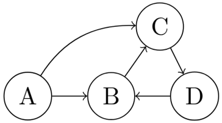
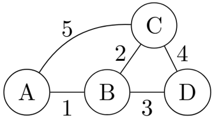

# Introdução

Essa seção tem o intuito de apresentar uma introdução à Teoria dos Grafos.


## Definição
Um grafo é representado por um par ordenado $G = (V, E)$, em que $V$ é o conjunto de vértices e $E$ é o conjunto de arestas. Eles podem ser utilizados para representar relações entre os vértices, através do uso das arestas. Por exemplo, os vértices podem ser vistos como cidades e as arestas como estradas, em que a aresta $(U,V)$ existe se há uma estrada entre as cidades $U$ e $V$.

Os exemplos a seguir serão baseados no seguinte grafo:
<figure markdown="span" class="graphs"> 
    
</figure>

$$
    V = \{A, B, C, D\}
$$

$$
    E = \{
            (A, B), (A, C),
            (B, C), (B, D),
            (C, D)
        \}
$$

### Vizinhança
Definimos a vizinhança $N$ de um vértice $V$ como o conjunto de vértices que estão ligados diretamente a $V$ através de uma aresta.
Em grafos direcionados, se temos a aresta $(U,V)$, então $V\in N(U)$ e $U\notin N(V)$.  

$$
N(V) = \{U | (V,U) \in E\}
$$

$$
\begin{aligned}
    &N(A) = \{B,C\} \\
    &N(B) = \{A,C,D\} \\
    &N(C) = \{A,B,D\} \\
    &N(D) = \{B,C\} 
\end{aligned}
$$

### Grau
O grau de um vértice $V$ é o número de arestas que incidem em $V$. Se existe uma aresta que liga um vértice nele mesmo (loops), ela conta duas vezes em seu grau. 
Em grafos direcionados, temos dois tipos de grau: de entrada e saida, que representam, respectivamente,
o número de arestas que entram e saem no vértice.

$$
    Deg(V) = \left|N(V) \right| + loops
$$

$$
\begin{aligned}
&Deg(A) = 2 \\
&Deg(B) = 3 \\
&Deg(C) = 3 \\
&Deg(D) = 2 
\end{aligned}
$$


### Componente Conexa

Uma componente conexa de um grafo é um subgrafo em que todo par de vértices está conectado por um caminho e não há conexão com vértices que não pertençam a tal subgrafo.

<figure markdown="span" class="graphs"> 
    
</figure>

O grafo acima possui duas componentes conexas:

$$
\begin{align}
    C_1 &= \{A, B, C \}  \\
    C_2 &= \{E, F, G, H \}
\end{align}
$$


## Tipos de Grafo

### Árvore
Uma árvore é um tipo de grafo geralmente utilizado para representar uma hierarquia entre os vértices. O vértice mais acima é chamado de Raiz, e a altura de cada vértice representa a sua distância até a raiz. Um vértice que não tem filhos é chamado de Folha.

Chamamos de floresta um grafo em que todas suas componentes são uma árvore.

<figure markdown="span" class="graphs"> 
    
</figure>
Árvore cuja raiz é o vertice A, e as folhas são os vértices C, D e F.


!!!tip "Características de árvorre"
    - Um vértice pode ter vários filhos, porém tem um único pai.
    - Possui exatamente $N-1$ arestas, sendo $N$ o número de vértices. 
    - Existe apenas um caminho entre dois vértices. 
    - Não apresenta ciclos 

### Grafos Direcionados
Um grafo direcionado ou orientado é um grafo em que suas arestas possuem um sentido.
Se um par $(U,V)$ pertence ao conjunto $E$ de arestas, então existe um caminho de $U$ para $V$,
mas não necessariamente existe um caminho de $V$ para $U$.

!!!tip "Representação das arestas"
    No grafo direcionado, as arestas geralmente são representadas por setas. 

<figure markdown="span" class="graphs"> 
    
</figure>

$$
\begin{aligned}
&\hphantom{..............}
V = \{A, B, C, D\} \\
&E = \{(A, B),\ (A, C),\ (B, C),\ (D, B),\ (C, D)\}
\end{aligned}
$$


No grafo acima, existe uma aresta entre os vértices $A$ e $C$, no entando não há um caminho que saia de $C$ e chegue em $A$. Em contrapartida, existe a aresta $(B,C)$ e um caminho de $C$ para $B$, passando pelo vértice $D$.

### Grafo Ponderado
Um grafo ponderado é um grafo que cada aresta possui um peso, ou seja, um valor. Formalmente, existe uma função $W$ que relaciona o conjunto de arestas $E$ do grafo aos numeros reais $\mathbb{R}$. Os pesos podem representar, por exemplo, custo ou distância entre os vértices.

<figure markdown="span" class="graphs"> 
    
</figure>

$$
\begin{aligned}
    W(A,B) = 1 \\
    W(B,C) = 2 \\
    W(B,D) = 3 \\
    W(C,D) = 4 \\
    W(A,C) = 5
\end{aligned}
$$

### Grafo Funcional
É um grafo direcionado em que cada vértice tem grau de saída exatamente igual à 1. 
Toda componente do grafo apresenta exatamente um ciclo.

<figure markdown="span" class="graphs"> 
    
</figure>

## Representação em código

Os exemplos a seguir serão baseados no seguinte grafo:
<figure markdown="span" class="graphs"> 
    
</figure>

### Matriz de Adjacência
Representamos o grafo como uma matriz $M$ de dimensão $N \times N$, sendo $N$ o número de vértices. Podemos
descobrir se existe uma aresta entre $U$ e $V$ em tempo constante apenas olhando para $M[U][V]$. No entanto, a complexidade de 
memória é $\mathcal{O}(N^2)$, o que pode ser inviável se o grafo tiver muitos vértices e poucas arestas (Grafos Esparsos).

$$
M[U][V] = \begin{cases}
0, & (U,V) \notin E \\
1, & (U,V) \in E
\end{cases}
$$

<figure markdown="span" class="graphs"> 
    
</figure>
Exemplo da matriz de Adjacência do grafo desenhado anteriormente.

```cpp title="adj_matrix.cpp"
#include <bits/stdc++.h>
using namespace std;

const int N = 1e3+5; ///número náximo de vértices do grafo
int adj[N][N]; //matriz de adjacência
int n,m; //numero de vértices e arestas

int main(){
    cin>>n>>m;

    for(int i=0;i<m;i++){
        int u,v;
        cin>>u>>v;

        adj[u][v] = 1;
        adj[v][u] = 1;
    }
}
```

### Lista de Adjacência
Para todo vértice $U$ do grafo, fazemos uma estrutura que armazena todo vértice $V\in N(U)$, ou seja, todo vértice $V$
na vizinhança de $U$. A complexidade de tempo para determinar se existe uma aresta entre os vértices $U$ e $V$ dependerá
da estrutura utilizada. Em grafos esparsos, a memória utilizada é consideravelmente menor do que em matrizes de adjacencia.

<figure markdown="span" class="graphs"> 
    
</figure>
Exemplo da lista de Adjacência do grafo desenhado anteriormente.

```cpp title="adj_list.cpp"
#include <bits/stdc++.h>
using namespace std;

const int N = 2e5+5; ///número náximo de vértices do grafo
vector<int> adj[N]; //lista de adjacência
int n,m; //numero de vértices e arestas

int main(){
    cin>>n>>m;

    for(int i=0;i<m;i++){
        int u,v;
        cin>>u>>v;

        adj[u].push_back(v);
        adj[v].push_back(u);
    }
}
```