# Dijkstra

## Introdução

Dado um grafo com $N, M \le 2\cdot 10^5$, com $N$ sendo o número de vértices e $M$ o número de arestas do grafo. O peso das arestas é positivo ($\ge 0$), e o grafo pode ser direcionado ou não direcionado. Queremos calcular a menor distância de um vértice $s$ para todos os outros vértices do grafo. Esse problema também é chamado de **Single Source Shortest Path** (ou SSSP).

Abaixo temos um slideshow de como o algoritmo vai funcionar a cada iteração, mas será explicado como o algoritmo funciona depois dele.

<div class="slider-wrapper">
  <!-- área de slides -->
  <div class="slides-container">
    <div class="image-sliderfade fade">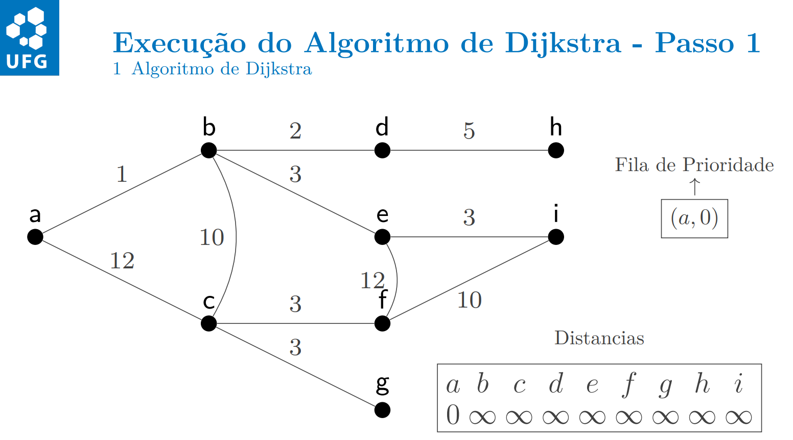</div>
    <div class="image-sliderfade fade">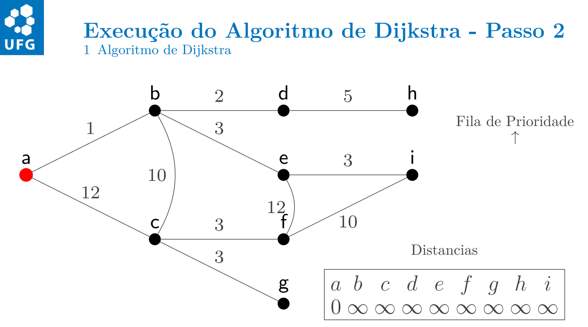</div>
    <div class="image-sliderfade fade">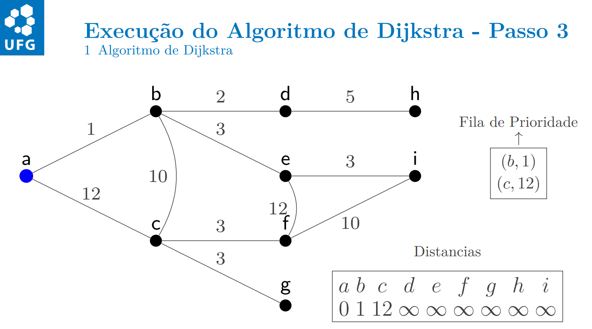</div>
    <div class="image-sliderfade fade">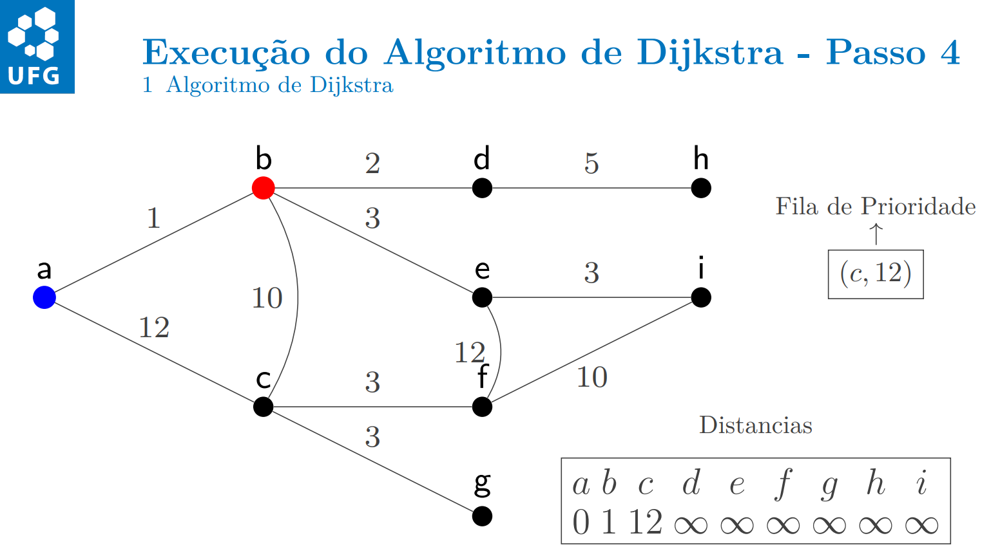</div>
    <div class="image-sliderfade fade">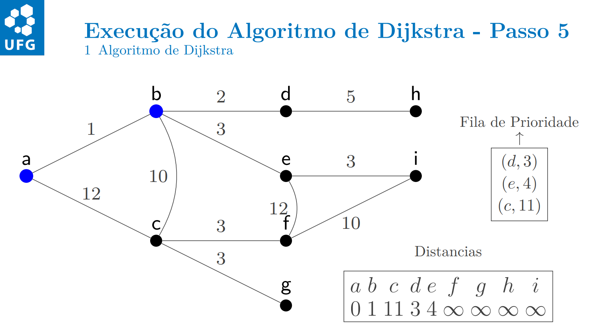</div>
    <div class="image-sliderfade fade">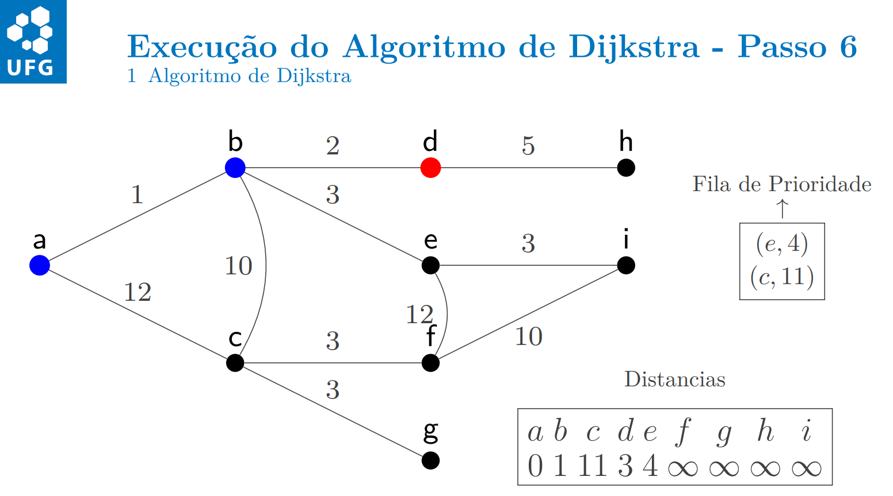</div>
    <div class="image-sliderfade fade">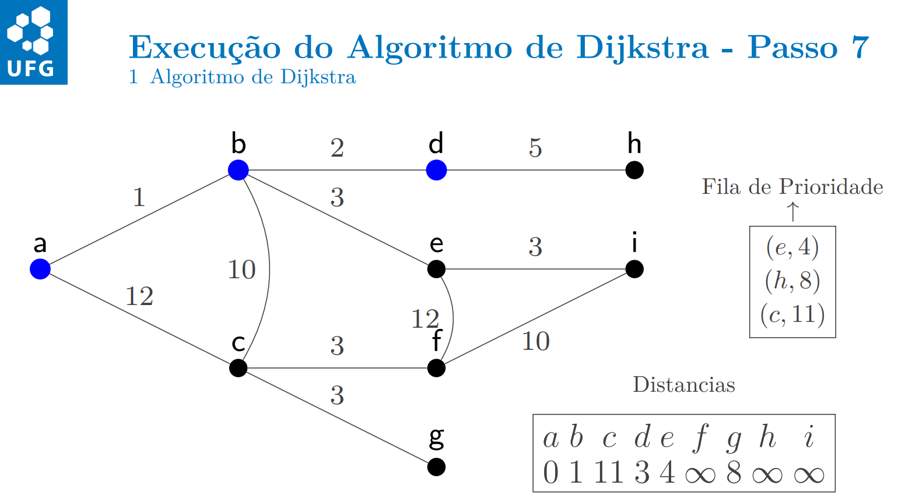</div>
    <div class="image-sliderfade fade">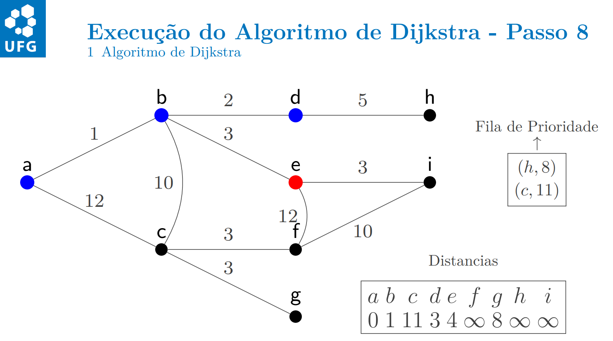</div>
    <div class="image-sliderfade fade"></div>
    <div class="image-sliderfade fade">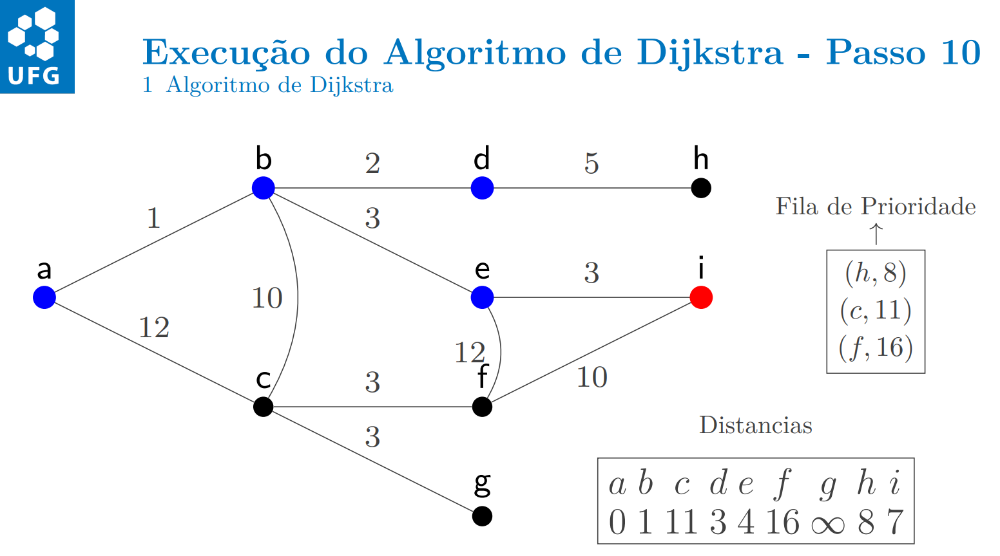</div>
    <div class="image-sliderfade fade">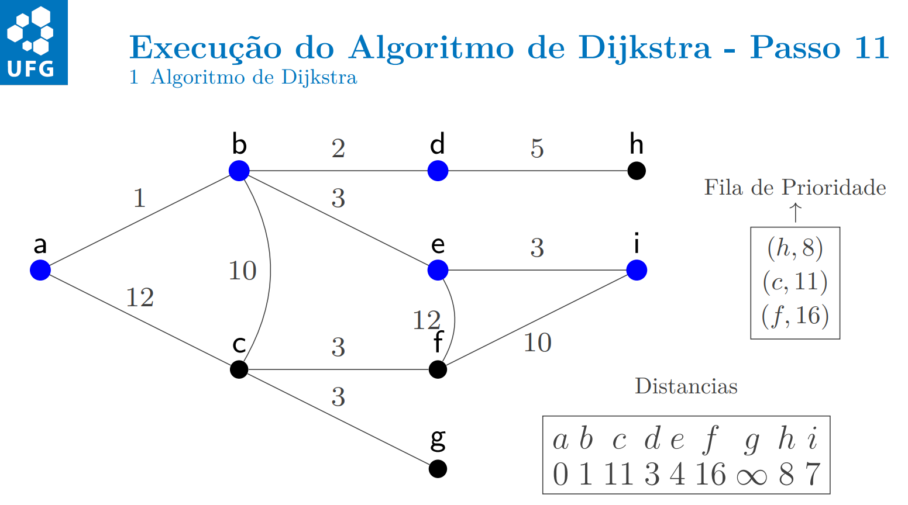</div>
    <div class="image-sliderfade fade">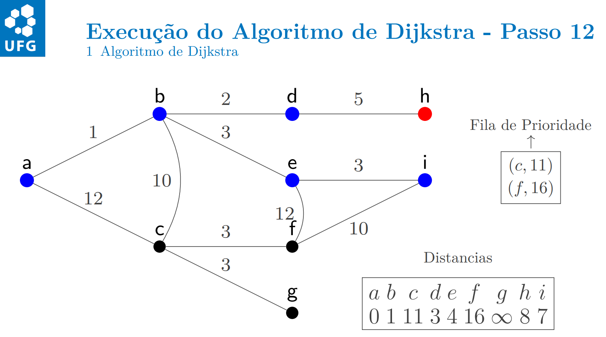</div>
    <div class="image-sliderfade fade">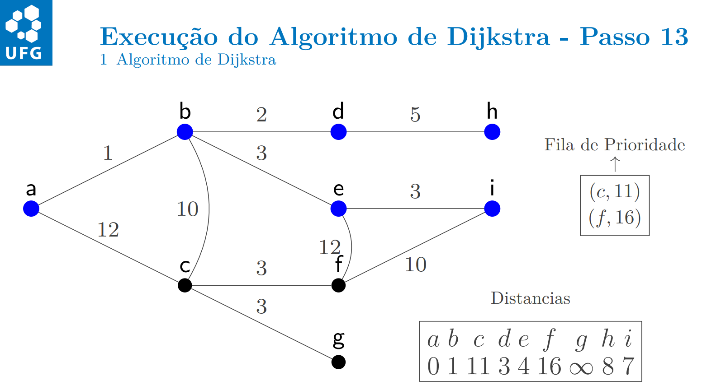</div>
    <div class="image-sliderfade fade"></div>
    <div class="image-sliderfade fade">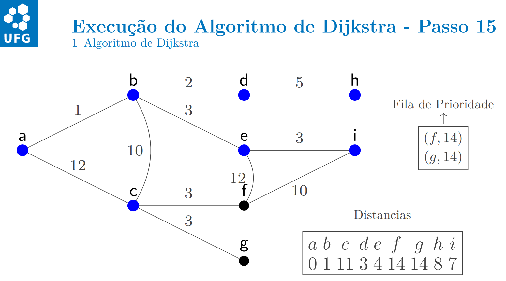</div>
    <div class="image-sliderfade fade">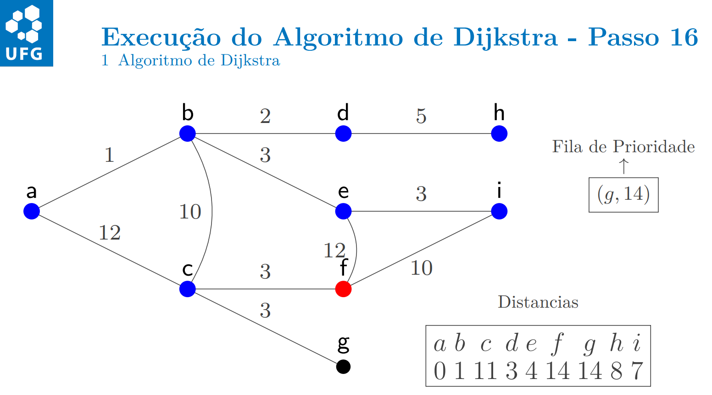</div>
    <div class="image-sliderfade fade">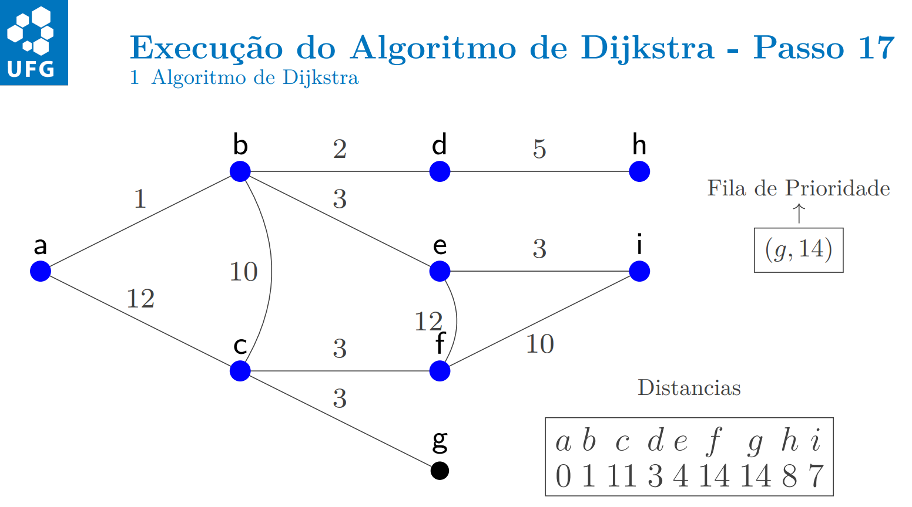</div>
    <div class="image-sliderfade fade">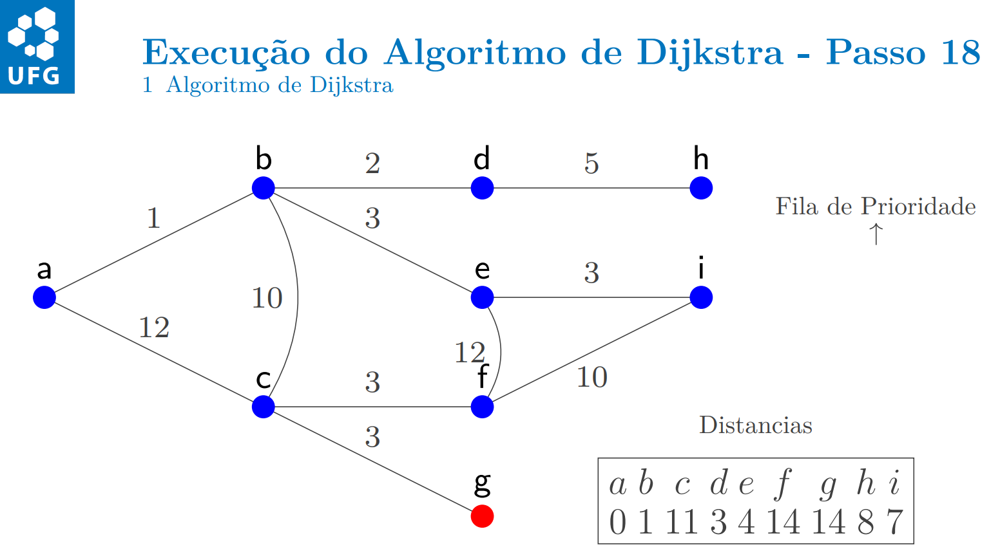</div>
  </div>

  <!-- índice no canto -->
  <div class="slide-index">1/3</div>

  <!-- barra de controles fixa embaixo -->
  <div class="controls-bar">
    <button class="ctrl prev" onclick="plusSlides(-1)">❮</button>
    <button class="ctrl next" onclick="plusSlides(1)">❯</button>
  </div>
</div>
<br>

## Algoritmo

O algoritmo foi desenvolvido por Edsger Dijkstra, e ele funciona da seguinte forma:

Crie um vetor $d[]$, onde para cada vértice $u$, ele conterá a menor distância atual do vértice $s$ até ele. No começo, $d[s]=0$, e todos os outros vértices serão inicializados com $\infty$. Para fins de implementação, podemos escolher um número grande o suficiente para representar o infinito, visto que esse numero grande não será alcançado no decorrer do algoritmo. Assim,


$$
  d[s]=0;
$$

$$
  d[u]=\infty, u\ne s
$$

O algoritmo consiste em pegar o vértice com menor distância até o presente momento que ainda não foi calculado. Para esse vértice, faremos um processo chamado **Relaxação de arestas**, que consiste em: seja $v$ um vizinho de $u$. A relaxação vai consistir em sempre tentar melhorar a distância até esse vértice $v$ antes de ele ser visitado pela primeira vez. Assim, pegaremos todas arestas do tipo $(u,v)$ e calcularemos a distância de se chegar no vértice $v$ a partir do vértice $u$, e pegaremos o mínimo da distância até esse vértice contida atualmente e somar a distância de $u$ com o peso da aresta até $v$. Assim, ficariamos com a seguinte expressão:

$$
  d[v]=min(d[v], d[u]+peso)
$$

Depois de se considerar todos os vértices, obteremos um vetor $d[]$ final, que conterá todas as menores distâncias de um vértice $s$ até todos os outros vértices, assim concluindo o algoritmo.

A implementação do algoritmo usará **Filas de prioridade**, ou **Priority queues**. Essa é uma estrutura de dados da STL e, caso não tenha visto, você pode ver na sessão de [STL](../../stl.md){: target="_blank" } como ela funciona e alguns problema que envolvem o seu uso. No nosso caso, a priority_queue da STL mantém o máximo no topo dela, então podemos fazer alguns ajustes para que ela retorne o mínimo em vez disso:

* Adicionamos a distância negativa na priority queue, assim invertendo a ordem da fila sem precisar alterá-la, ou
* Alterar a priority queue usando contêiners, que é um adaptador para a fila de prioridade.

Faremos uma fila de pares, onde o primeiro valor do par representa a distância total percorrida até agora, e o segundo representa o vértice em que estamos atualmente. Usaremos a implementação que usa a distância negativa na queue.

```cpp title="dijkstra.cpp" linenums="1"
const int N = 2e5+10;
const int inf = 1e9;

// [vértice, distância]
vector<pair<int,int>> graph[N];
int dist[N];

void dijkstra(int s) {
    priority_queue<pair<int,int>> q; // fila de prioridade

    // usando conteiners
    // priority_queue<pair<int,int>, vector<pair<int,int>>, greater<>> q;

    q.push(make_pair(0, s));

    dist[s] = 0;

    while(q.empty() == false) {
        pair<int,int> u = q.top();
        q.pop();
        u.first = -u.first; // passando o valor para positivo.
        // usando conteiners, nao precisa passar para positivo.

        if(u.first != dist[u.second]) continue;

        for(auto v: graph[u.second]) {
            int tmp = u.first + v.second; // somando as distâncias.
            if(tmp < dist[v.first]) {
                dist[v.first] = tmp;
                q.push(make_pair(-dist[v.first], v.first));
            }
        }
    }
}
```

Esse algoritmo roda em $\mathcal{O}(M \cdot \log_2 N)$, onde o log vem da Priority Queue, e o $M$ é a quantidade de arestas presentes no grafo.

## Erros comuns

Algumas implementações do algoritmo de Dijkstra são equivalentes a apresentada acima. Uma implementação que usa um vetor de visitados em vez de um vetor de distâncias atinge a mesma complexidade algorítmica, ou uma que use ambas informações. Agora, há alguns erros que acabaram ficando comuns, e que algumas vezes eles podem acabar passando despercebido até mesmo pelos casos de teste dos problemas espalhados pelos vários judges online que temos por aí. Então, nessa sessão eu separei alguns dos erros que podem acabar sendo cometidos e como evitá-los:

1. **Uso do valor infinito pequeno demais**: Pode acontecer de que o valor de distância escolhido seja pequeno, ou seja, essa distância pode ser alcançada com o algoritmo de Dijkstra, o que pode levar a bugs na hora de calcular a distância mínima de alguns vértices do seu grafo. Inclusive, o valor de infinito escolhido no algoritmo é simbólico, já que a maioria dos problemas usam pesos nas arestas como $\le 10^9$, e como são geralmente $10^5$ arestas, os valores para distância podem chegar a $10^{14}$, que é um valor alto por si só. Então lembrem-se de escolher bem seus valores de infinito.

2. **Recalcular o mesmo vértice várias vezes**: Na linha $24$ do algoritmo apresentado, há uma verificação que diz que: se a distância percorrida atual é diferente da distância guardada no vetor, não realizamos essa iteração no algoritmo. Isso significa que só iremos realizar qualquer mudança nas distâncias a partir daquele vértice se o valor de distância for igual ao valor calculado no vetor anteriormente, que já é o mínimo possível. Um erro comum é esquecer de fazer essa verificação, o que pode ser contornado caso você use um vetor de visitados, e quando entrar em um vértice pela primeira vez, visitá-lo para evitar de fazer cálculos nele novamente, ou não esquecer de fazer essa verificação, ambos são suficientes.

3. **Visitar o grafo na ordem dos vértices e não dos pesos**: Parece um erro ridículo, mas também acontece quando você mantém o par da queue como $(indice, peso)$ em vez de $(peso, indice)$, e a partir daí começam os bugs que podem se tornar imperceptíveis.

4. **Usar o algoritmo quando há arestas negativas**: O algoritmo de Dijkstra ***não funciona*** quando há arestas negativas, pois isso quebra o fato de que se entramos em um vértice, ele possue a menor distância possível, pois agora é possível que algum cálculo futuro que possa modificar algum vértice já visitado ainda tenha como melhorá-lo. Para calcular distância quando arestas negativas estão presentes, refiram-se aos algoritmos de Bellman Ford e Floyd Warshall, que podem lidar com arestas negativas (e com ciclos negativos) no grafo.

5. **Atualizações erradas feitas na distância:** Nas linhas $28$ a $31$ do algoritmo, há uma verificação sobre a distância percorrida atualmente ser menor do que a distância salva até aquele momento, e que caso isso seja verdade, a gente atualiza a distância e coloca esse vértice na fila. Uma coisa importante que precisa ser comentada: Nesse momento, devemos atualizar a distância no vetor de distâncias, pois o que pode ocorrer é ter muitos vértices na fila sendo processados muitas vezes caso isso não ocorra, podendo subir para a complexidade $\mathcal{O}(n^{2})$.

## Problemas recomendados
- <a href="https://cses.fi/problemset/task/1671" target="_blank">CSES - Shortest Routes I</a>
- <a href="https://codeforces.com/problemset/problem/20/C" target="_blank">Codeforces - Dijkstra?</a>
- <a href="https://cses.fi/problemset/task/1195" target="_blank">CSES - Flight Discount</a>
- <a href="https://cses.fi/problemset/task/1196" target="_blank">CSES - Flight Routes</a>
- <a href="https://codeforces.com/group/SFkT4V3SYb/contest/625408/problem/D" target="_blank">OBI - Viagem</a>
- <a href="https://cses.fi/problemset/task/1202" target="_blank">CSES - Investigation</a> 
- <a href="https://codeforces.com/contest/2014/problem/E" target="_blank"> Codeforces - Rendez-vous de Marian et Robin </a>
- <a href="https://codeforces.com/contest/1915/problem/G" target="_blank"> Codeforces - Bicycles</a>
