# Prim

  <!-- área de slides -->
  

    

    
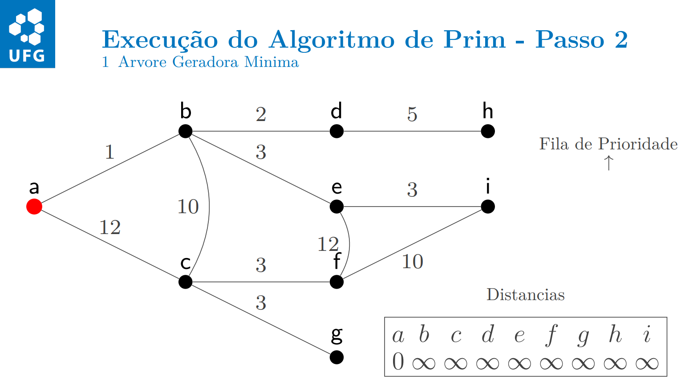

    

    
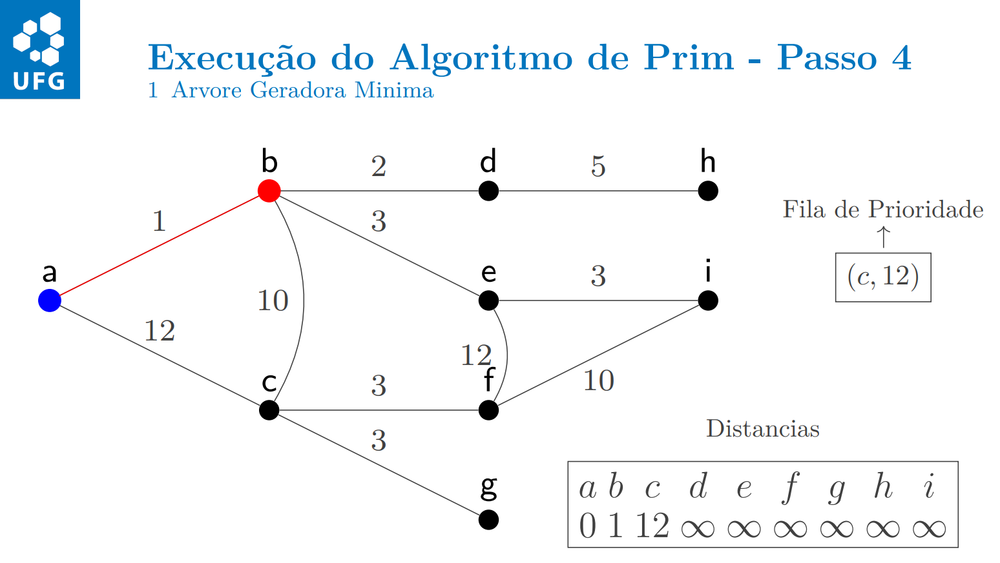

    

    
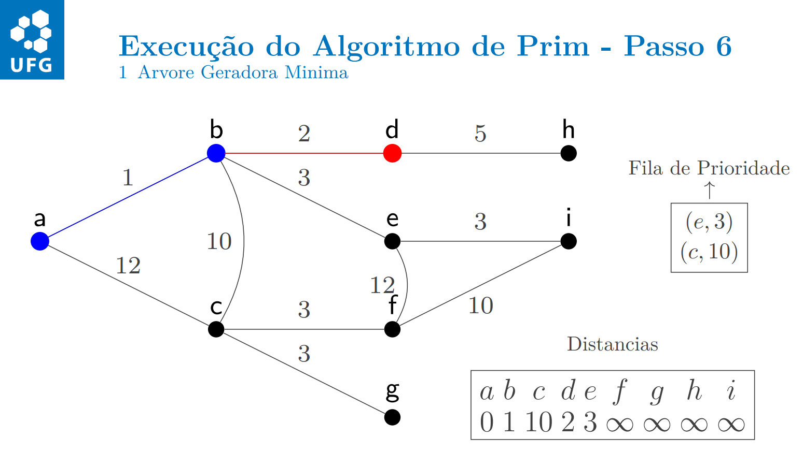

    
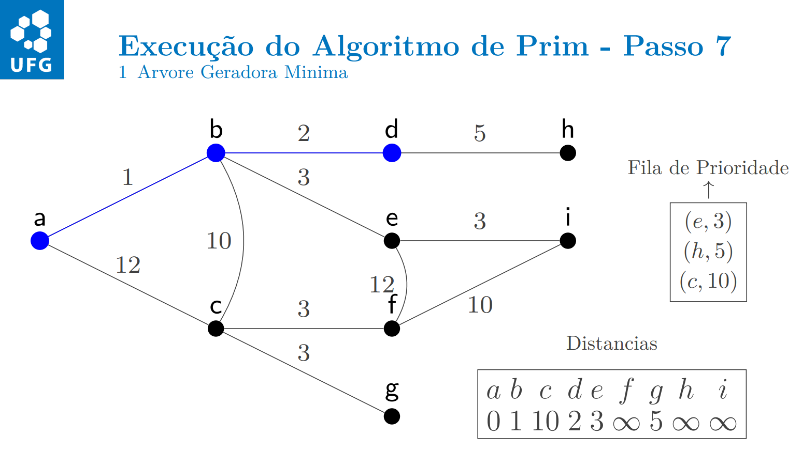

    
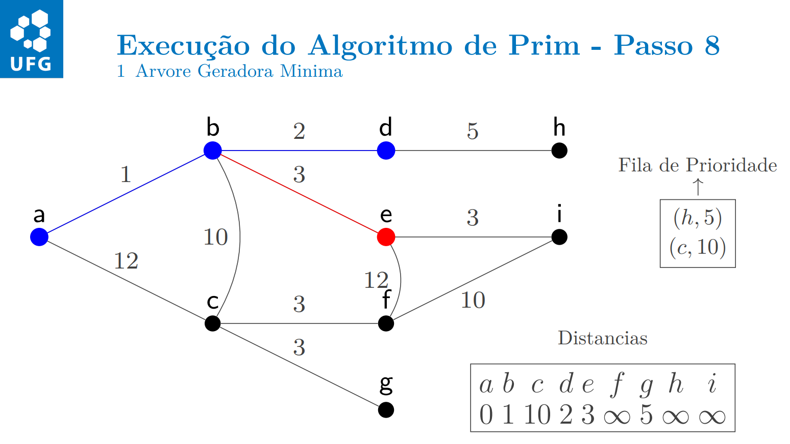

    
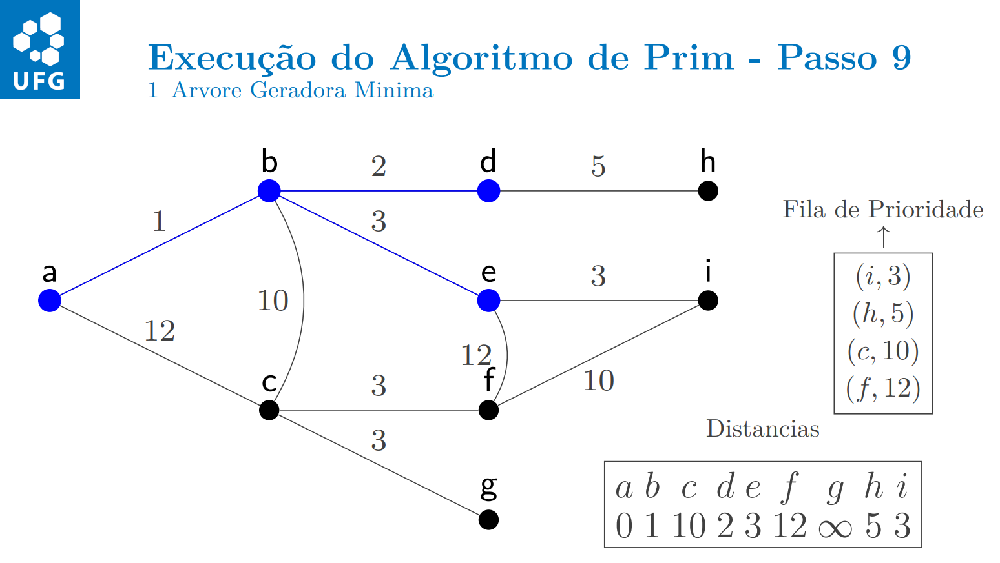

    
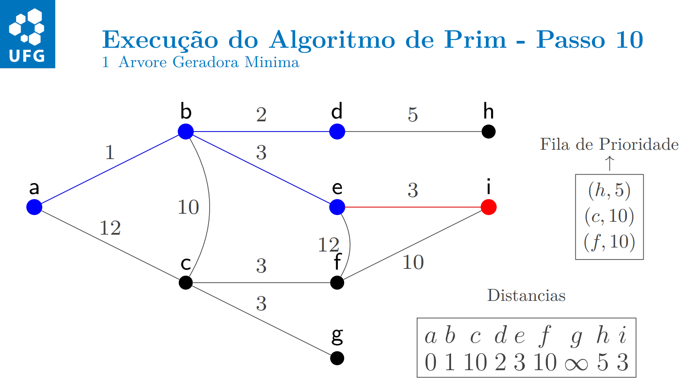

    
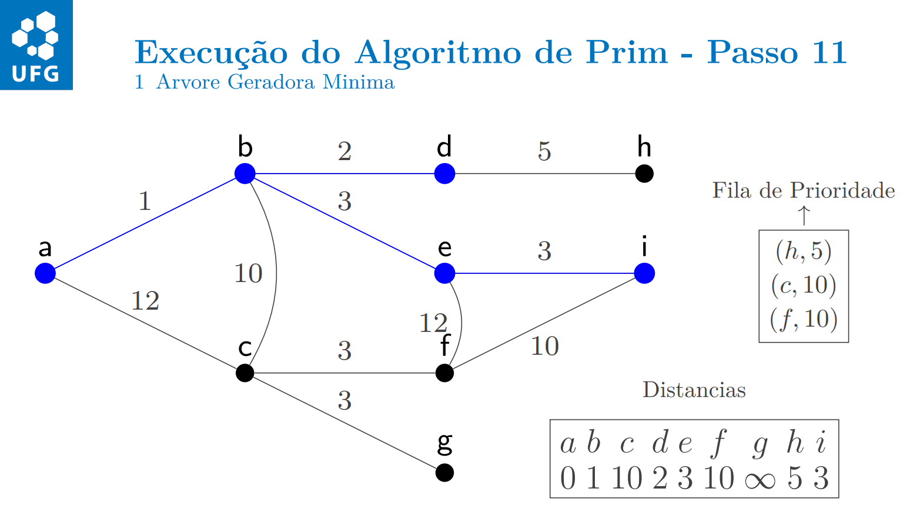

    
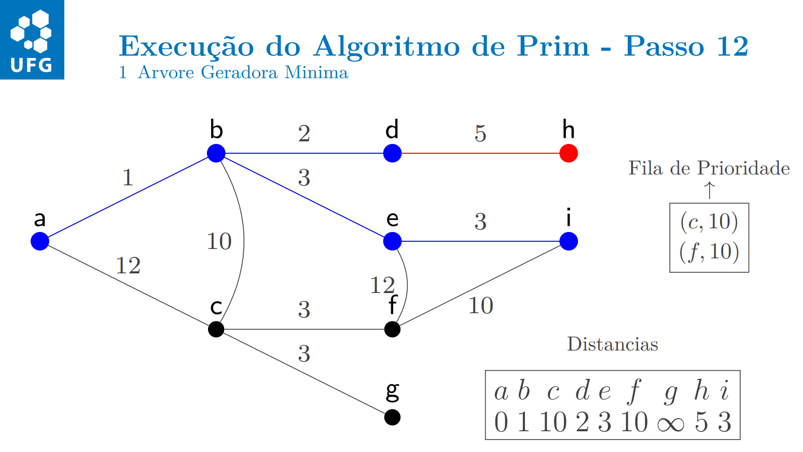

    
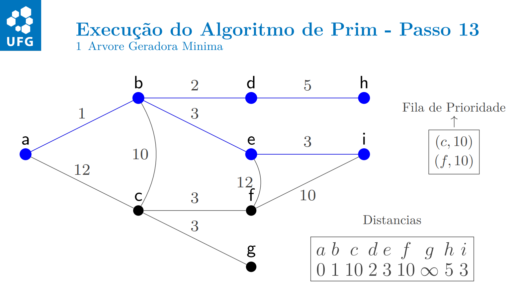

    
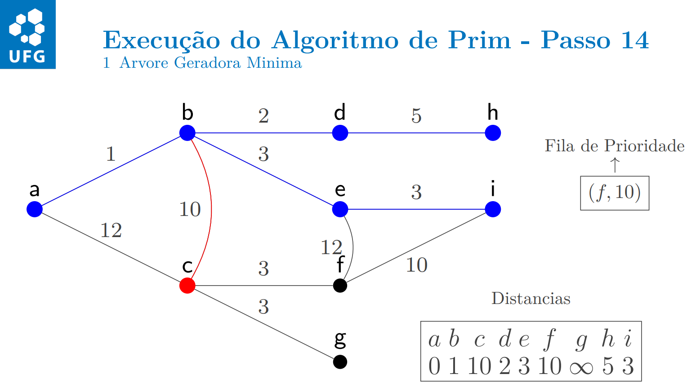

    
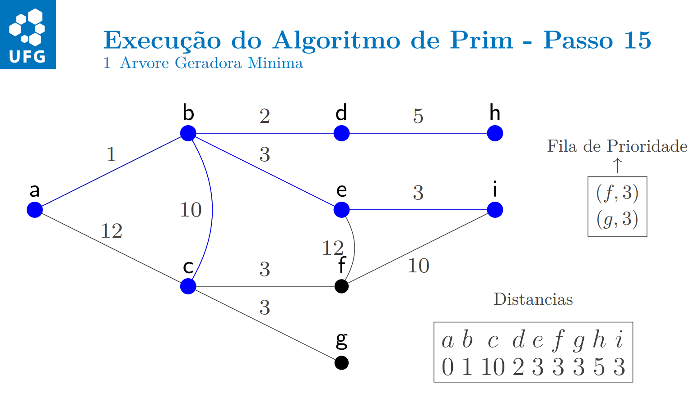

    
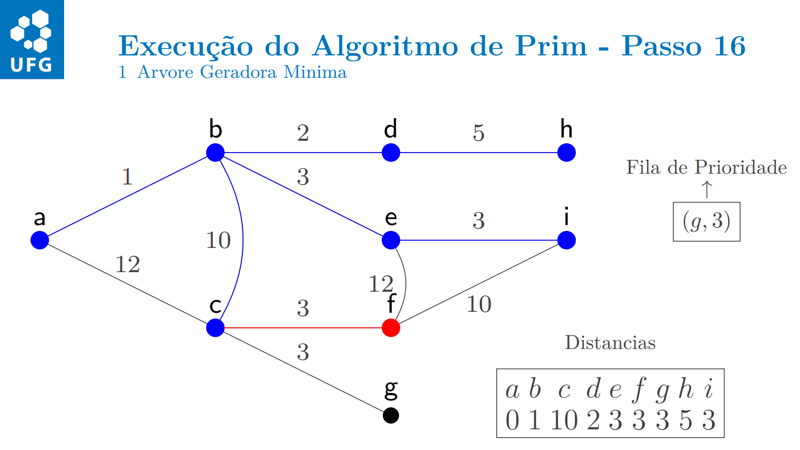

    
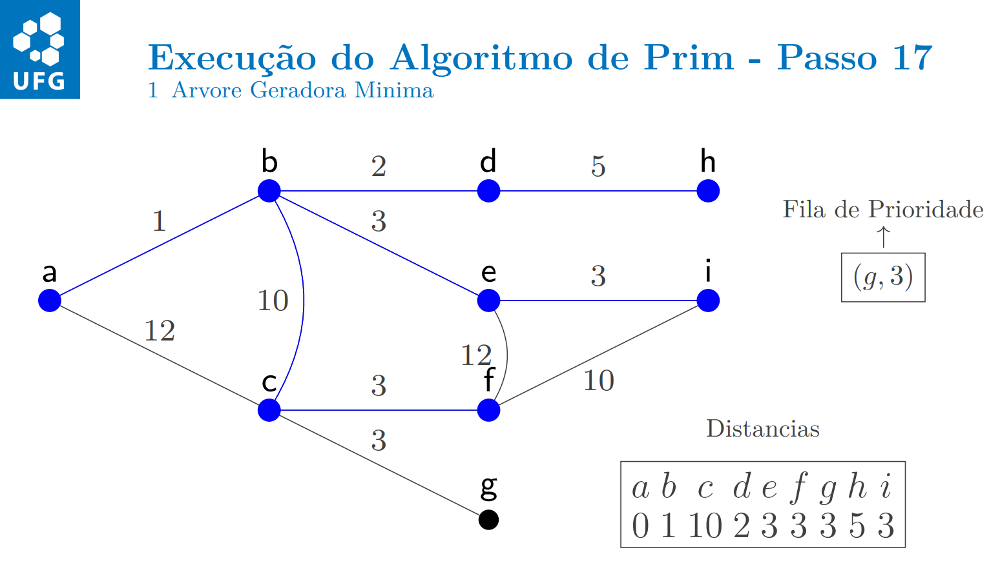

    
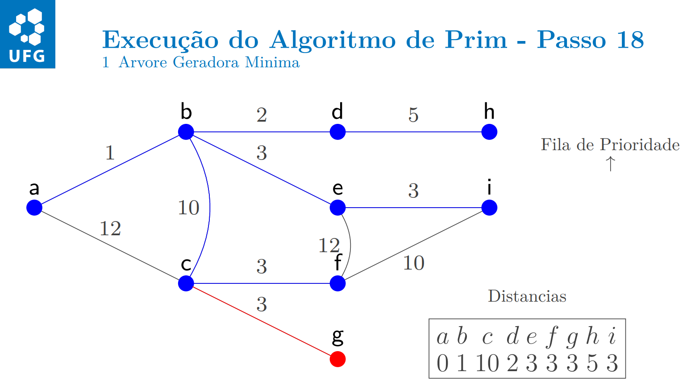

    
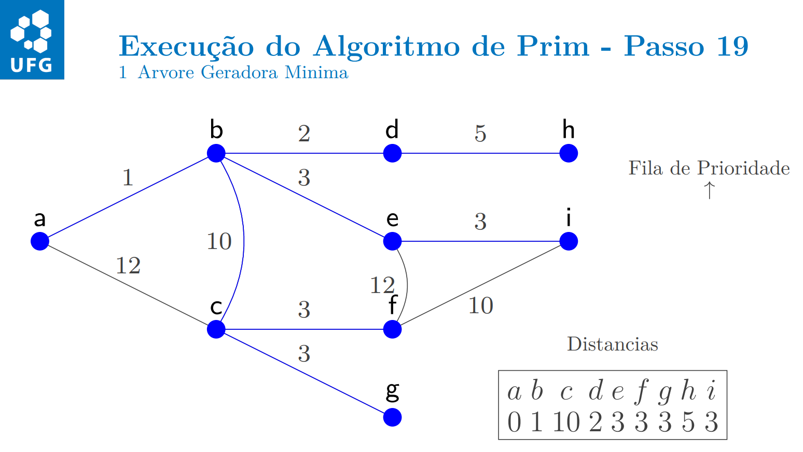

  

  <!-- índice no canto -->
  
1/3

  <!-- barra de controles fixa embaixo -->
  

    <button class="ctrl prev" onclick="plusSlides(-1)">❮</button>
    <button class="ctrl next" onclick="plusSlides(1)">❯</button>
  

 