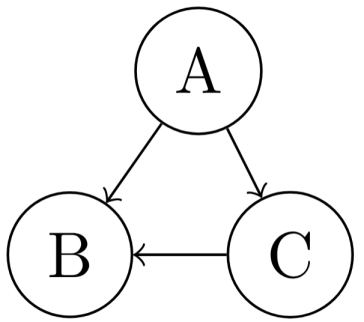

# Depth First Search (DFS)

A busca em profundidade (DFS) é uma técnica para percorrer grafos . Ela começa em um vértice inicial e segue para um novo vértice adjacente que ainda não foi visitado. Quando não há mais vértices adjacentes a serem visitados, o algoritmo volta para o vértice anterior e tenta explorar outros caminhos.

<div class="slider-wrapper">
  <!-- área de slides -->
  <div class="slides-container">
    <div class="image-sliderfade fade"></div>
    <div class="image-sliderfade fade"></div>
    <div class="image-sliderfade fade"></div>
    <div class="image-sliderfade fade"></div>
    <div class="image-sliderfade fade"></div>
    <div class="image-sliderfade fade"></div>
    <div class="image-sliderfade fade"></div>
    <div class="image-sliderfade fade"></div>
    <div class="image-sliderfade fade"></div>
    <div class="image-sliderfade fade"></div>
    <div class="image-sliderfade fade"></div>
    <div class="image-sliderfade fade"></div>
    <div class="image-sliderfade fade"></div>
    <div class="image-sliderfade fade"></div>
    <div class="image-sliderfade fade"></div>
    <div class="image-sliderfade fade"></div>
    <div class="image-sliderfade fade"></div>
    <div class="image-sliderfade fade"></div>
  </div>

  <!-- índice no canto -->
  <div class="slide-index">1/3</div>

  <!-- barra de controles fixa embaixo -->
  <div class="controls-bar">
    <button class="ctrl prev" onclick="plusSlides(-1)">❮</button>
    <button class="ctrl next" onclick="plusSlides(1)">❯</button>
  </div>
</div>
<br>

## Implementação

O algoritmo pode ser implementado utilizando uma estrutura de pilha, em que o topo da pilha representa o vértice atual. Assim, iteramos sobre a vizinhança dele e adicionamos à pilha um vértice adjacente ainda não visitado.

```cpp title="dfs_iterativo.cpp" linenums="1"
const int N = 2e5+5; // número maximo de vertices
vector<int>adj[N]; //lista de adjacencia
bool vis[N]; //vetor de visitado para os vertices

void dfs(int start){
    stack<int> p;
    p.push(start);

    while(p.size()){
        int u = p.top();
        p.pop();

        if(vis[u]) continue;
        vis[u] = true;

        for(int v: adj[u]){
            if(!vis[v]){
                p.push(v);
            }
        }
    }
}
```

Também podemos implementar o DFS de forma recursiva, simplificando o código

```cpp title="dfs_recursivo.cpp" linenums="1"
void dfs(int u){
    vis[u] = true;

    for(int v: adj[u]){
        if(!vis[v]){
          dfs(v);
        }
    }
}
```

## Aplicações

### Contar componentes 

#### Quantidade de componentes
A busca em profundidade é capaz de contar o número de componentes conexas de um grafo. Basta iterar sobre todos os vértices do grafo e, para cada vértice ainda não visitado, executa-se o algoritmo para marcar os vértices em sua componente como visitados, somando um à quantidade de componentes.

```cpp title="components.cpp" linenums="1"
int components(){
  int qtd = 0;

  for(int i=1;i<=n;i++){
    if(!vis[i]){
      qtd++;
      dfs(i);
    }
  }

  return qtd;
}
```

#### Tamanho de uma componente
Pode-se adaptar o algoritmo para retornar quantos vértices fazem parte de uma componente do  grafo.

```cpp title="components_size.cpp" linenums="1"
int dfs(int u){
  int tam = 1;

  vis[u] = true;

  for(int v:adj[u]){
    if(!vis[v]){
      tam += dfs(v);
    }
  }

  return tam;
}
```

### Bipartição

Para descobrir se um grafo é bipartido e, caso for, achar sua bipartição, podemos rodar um DFS que carrega além do vértice atual, a cor desse vértice. Assim, para cada chamada da função nós podemos inverter a cor. Caso um vértice tenha mesma cor de um vértice adjacente, o grafo não é bipartido.

A bipartição do grafo ficará guardada no vetor ```cor```, em que ```cor[u]``` guarda se o vértice $u$ pertence à cor ```0``` ou ```1```.

Para facilitar a implementação, pode-se utilizar o operador $xor$ ``` ^ ``` para inverter a cor entre ```0``` e ```1```, e o operador $and$ ```&``` para garantir que, caso apenas uma tentativa retorne ```false```, todas as demais também serão falsas. 


```cpp title="biparticao.cpp" linenums="1"
bool dfs(int u, int c){
    
  vis[u] = true;
  cor[u] = c;

  bool ok = true;
  for(int v:adj[u]){
    if(!vis[v]){
      ok &= dfs(v, c ^ 1);
    }

    if(cor[v] == cor[u]){
      return false;
    }
  }

  return ok;
}
```

### Caminho entre dois vértices

Podemos adicionar ao algoritmo um vetor ```pai```, em que ```pai[u]``` guarda o vértice que chamou o DFS para o vértice ```u```. Assim, executa-se o DFS a partir do vértice ```v```. Depois basta começar no vértice ```u``` e ir voltando utilizando o vetor de pais até chegar no vértice ```v```, guardando todo vértice intermediário na resposta. 

```cpp title="path.cpp" linenums="1"
void dfs(int u, int p){
    
  vis[u] = true;
  pai[u] = p;

  for(int v:adj[u]){
    if(!vis[v]){
      dfs(v, u);
    }
  }
}

vector<int> find_path(int u, int v){
  dfs(v, v);

  vector<int> path;

  if(!vis[u]) return path;

  int at = u;
  while(at != v){
    path.push_back(at);
    at = pai[at];
  }
  path.push_back(v);

  return path;
}

```

### Ciclos
#### Grafos Não direcionados
Para identificar se um grafo não direcionado possui um ciclo, algum vértice é adjacente à um vértice que já foi visitado anteriormente, que não seja o seu pai.

Para facilitar a implementação, utilizaremos o operador $or$ ```|```, para que caso alguma instância do DFS retorne ```true```, as demais também irão.

```cpp title="undirected_cycle.cpp" linenums="1"
bool dfs(int u, int p){
  vis[u] = true;
 
  bool ok = false;
  for(int v:adj[u]){
    if(vis[v] && v!=p){
      //ciclo contendo os vértices u e v.
      return true;
    }
 
    if(!vis[v]){
      ok |= dfs(v, u);
    }
  }

  return ok;
}
```

#### Grafos Direcionados
Achar um ciclo em um grafo direcionado é mais complexo, pois podemos chegar em um vértice que já foi visitado mas não faz parte de um ciclo.

Por exemplo, no grafo abaixo, uma possível ordem de visita do DFS é $A, B, C$. Quando estamos no vértice $C$, o vértice $B$ já teria sido visitado, porém ele não faz parte de um ciclo.

<figure markdown="span" class="graphs"> 
    
</figure>

Para resolver esse problema, iremos utilizar a seguinte coloração:

$$
cor[u] = 
\begin{cases}
0 &,\text{ se o dfs de u não foi iniciado} \\
1 &,\text{ se o dfs de u está sendo executado} \\
2 &,\text{ se o dfs de u terminou de ser executado} \\
\end{cases}
$$

Desse modo, um ciclo existe se há uma aresta ligando dois vértices de cor $1$, ou seja, o DFS de dois vértices adjacentes ainda não terminou.

```cpp title="directed_cycle.cpp" linenums="1"
bool dfs(int u){
  vis[u] = 1;
  cor[u] = 1;

  bool ok = false;
  for(int v:adj[u]){
    if(cor[v] == 1){
      //ciclo contendo os vértices u e v.
      return true;
    }
 
    if(!vis[v]){
      ok |= dfs(v, u);
    }
  }

  cor[u] = 2;

  return ok;
}
```

#### Recuperando um ciclo
Para recuperar um ciclo, basta verificar a existência de ciclos no grafo e, caso existir, armazenar dois vértices $u$ e $v$ que fazem parte de um ciclo e recuperar o caminho de $u$ até $v$. O ciclo será o mesmo caminho, porém com uma aresta adicional, voltando para $u$.

## Problemas recomendados
- <a href="https://cses.fi/problemset/task/1666" target="_blank">CSES - Building Roads</a>
- <a href="https://cses.fi/problemset/task/1668" target="_blank">CSES - Building Teams</a>
- <a href="https://atcoder.jp/contests/abc404/tasks/abc404_c" target="_blank">Atcoder - Cycle Graph?</a>
- <a href="https://atcoder.jp/contests/abc270/tasks/abc270_c" target="_blank">Atcoder - Simple Path</a>
- <a href="https://cses.fi/problemset/task/1669" target="_blank">CSES - Round Trip</a>
- <a href="https://cses.fi/problemset/task/1678" target="_blank">CSES - Round Trip II</a>
- <a href="https://cses.fi/problemset/task/1679" target="_blank">CSES - Course Schedule</a>

