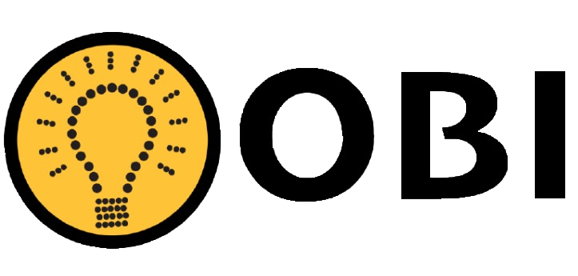
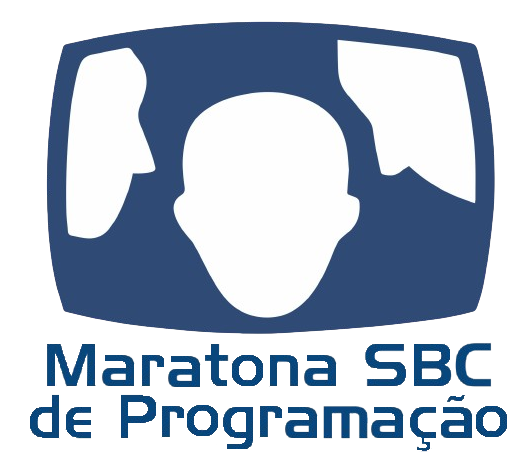

# Competições

As competições de programação consistem em resolver um conjunto de problemas dentro de um tempo determinado. Elas podem ser individuais ou em equipe. Esses problemas são elaborados, solucionados e testados por "setters" (criadores de problemas).

A resolução de problemas em programação competitiva geralmente segue duas etapas principais:

  **1**. **Criação do algoritmo**: Essa fase exige habilidades de resolução de problemas e intuição para desenvolver a lógica por trás da solução.
  
  **2**. **Implementação do algoritmo**: Nesta etapa, é preciso traduzir o algoritmo em código, utilizando suas habilidades de programação.

Após codificar sua solução, você a submete a um avaliador automático. Ele verifica se as respostas geradas pelo seu programa estão corretas, comparando-as com um conjunto de casos de teste pré-determinados. É importante lembrar que cada problema possui limites de tempo e memória que seu programa deve respeitar para ser aceito, e abordaremos isso em mais detalhes adiante.

---

{  width=250 align=left .no-margin }

<h3 class="no-top-margin"><strong>Olimpíada Brasileira de Informática (OBI)</strong></h3>
A Olimpíada Brasileira de Informática (OBI) é uma competição individual que acontece anualmente. O objetivo da OBI é despertar interesse nos alunos de todas as idades pela ciência da computação. A organização da OBI está a cargo do instituto de computação da UNICAMP.

A OBI está organizada em duas modalidades, e cada modalidade é dividida em níveis. Em todas as modalidades e níveis os alunos competem individualmente. Cada aluno poderá ser inscrito e participar em apenas um modalidade e nível.

#### Modalidade Iniciação
Na modalidade Iniciação, alunos que ainda não sabem programar competem resolvendo problemas de lógica e problemas de raciocínio computacional, sem uso de computador, apenas utilizando lápis e papel. 

A modalidade Iniciação tem três níveis:

- Nível Júnior, para alunos do 4º e 5º anos do Ensino Fundamental;
- Nível 1, para alunos do 6º e 7º anos do Ensino Fundamental;
- Nível 2, para alunos do 8º e 9º anos do Ensino Fundamental.

#### Modalidade Programação
A prova da modalidade Programação exige conhecimento em programação e é necessário prover um computador por participante, na ocasião da prova. A prova é composta de tarefas de programação com níveis variados de dificuldade: há tarefas mais fáceis, em que um conhecimento mínimo de programação é suficiente, e algumas tarefas mais difíceis, que exigem um conhecimento um pouco mais avançado de programação, como noções de estruturas de dados, algoritmos e técnicas de programação.

Os níveis da Modalidade Programação são:

- Nível Júnior, para alunos de qualquer ano do Ensino Fundamental;
- Nível 1, para alunos do Ensino Fundamental ao 1º ano do Ensino Médio;
- Nível 2, para alunos do Ensino Fundamental ao 3º ano do Ensino Médio;
- Nível Sênior, para alunos do 4º ano do Ensino Técnico e alunos cursando pela primeira vez o 1º ano de um curso de graduação.

#### Premiação
Todos os participantes receberão certificados de participação. Os melhores colocados de cada modalidade receberão ainda medalhas de ouro, prata e bronze.

Para mais detalhes: <a href="https://olimpiada.ic.unicamp.br/" target="_blank">https://olimpiada.ic.unicamp.br/</a>

---

{  width=250 align=left .no-margin }

### **Maratona de Programação da SBC**

A Maratona de Programação da SBC (Sociedade Brasileira de Computação) é uma das maiores e mais tradicionais competições de programação do país. Voltada para estudantes de graduação em Computação e áreas afins, a maratona ocorre anualmente e é uma competição em equipe, sendo três competidores e um coach. 

Mais detalhes do regulamento: <a href = "https://maratona.sbc.org.br/sobre/regras.html" target = "_blank">https://maratona.sbc.org.br/sobre/regras.html</a>

A competição atualmente é dividida em três fases:

#### Fase Zero
A Fase Zero é uma etapa opcional e preparatória da Maratona de Programação da SBC, criada com o objetivo de introduzir novos participantes ao formato da competição.
Ela não é classificatorória, ou seja, os resultados da Fase Zero não influenciam na seleção para as próximas etapas.

#### Primeira Fase  
A Primeira Fase ocorre em várias sedes espalhadas pelo país de forma simultânea, a prova inicia às 14:00 de Brasília e é disputada presencialmente. Essa fase determina os times que ocuparão as vagas da Final Brasileira, para classificar é necessário:

- Estar entre os primeiros 15° colocados da competição **ou**

- Estar em uma sede e ser o melhor time da sede **ou**

- Ser um time com participação feminina e estar entre os melhores colocados entre os times com participação feminina. 3 vagas para os times com 3 mulheres melhor colocados; 2 vagas para os times mais bem colocados com pelo menos 2 mulheres; 1 vaga para o time melhor colocado com participação feminina.

A ordem de prioridade é Top 15 \(\rightarrow\) Melhor time da sede \(\rightarrow\) Feminina. Se por exemplo, uma equipe feminina se classificar entre os 15 melhores, a vaga ocupada será do Top 15 e não uma das vagas femininas. Além disso, cada escola pode classificar, no máximo, dois times. Se por exemplo, existirem 3 times de uma mesma escola no Top 15, então apenas os dois melhores são classificados e a décima sexta melhor equipe passa a fazer parte do critério de classificação do Top 15.

#### Final Brasileira
A Final Brasileira é disputada em uma sede de maneira presencial com todos os classificados da Primeira Fase. Todo ano uma sede é definida para ser anfitriã da competição e os melhores times são classificados para as Finais Latino-Americanas da competição.

---

### **Maratona Feminina de Programação (MFP)**

A **Maratona Feminina de Programação (MFP)** é uma competição da Sociedade Brasileira de Computação (SBC) feita para mulheres e pessoas não binárias que cursam graduação em Computação e áreas afins.

Fique por dentro das novidades da MFP no Instagram: <a href = "https://www.instagram.com/mfp.sbc/" target = "_blank">https://www.instagram.com/mfp.sbc/</a>

#### **Como Funciona**

A MFP é uma prova individual, com um limite de tempo de 5 horas, para resolver entre 8 e 9 problemas.

A competição é dividida em fases:

* **Primeira Fase:** Uma etapa classificatória, que pode ser online ou presencial em várias cidades, onde as participantes buscam uma vaga para a fase final.

* **Fase Final:** As melhores participantes da primeira fase se encontram presencialmente na UNICAMP para a fase final.

Para mais informações, você pode conferir o edital da MFP no Linktree: <a href = "https://linktr.ee/mfp.sbc" target = "_blank">Linktree MFP</a>

Além da competição, a MFP costuma oferecer **cursos e workshops** para ajudar as participantes a se prepararem e aprenderem ainda mais.

Você pode conferir as aulas no canal da Maratona SBC: <a href = "https://www.youtube.com/playlist?list=PL_LXOen7bfUBq-1_dduDaibACuWJfycPR" target = "_blank">Playlist MFP</a>

---

### **Competições Online**

Uma ótima maneira de praticar programação competitiva é participar de competições online. Dentre os principais sites, temos:

* <a href = "https://codeforces.com/" target = "_blank">Codeforces</a>
* <a href = "https://atcoder.jp/" target = "_blank">AtCoder</a>
* <a href = "https://www.codechef.com/" target = "_blank">CodeChef</a>

Cada um desses sites possui seu formato de prova. Você pode conferir mais informações na [seção de sites](../../../sites/codeforces).