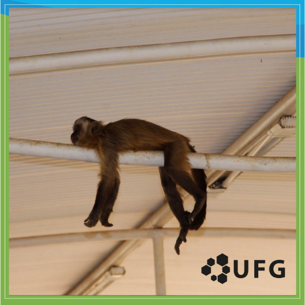

# Competições

As competições de programação consistem em resolver um conjunto de problemas dentro de um tempo determinado. Elas podem ser individuais ou em equipe. Esses problemas são elaborados, solucionados e testados por "setters" (criadores de problemas).

A resolução de problemas em programação competitiva geralmente segue duas etapas principais:

  **1**. **Criação do algoritmo**: Essa fase exige habilidades de resolução de problemas e intuição para desenvolver a lógica por trás da solução.
  
  **2**. **Implementação do algoritmo**: Nesta etapa, é preciso traduzir o algoritmo em código, utilizando suas habilidades de programação.

Após codificar sua solução, você a submete a um avaliador automático. Ele verifica se as respostas geradas pelo seu programa estão corretas, comparando-as com um conjunto de casos de teste pré-determinados. É importante lembrar que cada problema possui limites de tempo e memória que seu programa deve respeitar para ser aceito, e abordaremos isso em mais detalhes adiante.

{  width=250 align=left .no-margin }

<h3 class="no-top-margin"><strong>Olimpíada Brasileira de Informática (OBI)</strong></h3>
A Olimpíada Brasileira de Informática (OBI) é uma competicão individual que acontece anualmente. O objetivo da OBI é despertar interesse nos alunos de todas as idades pela ciencia da computação. A organização da OBI está a cargo do instutito de computação da UNICAMP.

A OBI está organizada em duas modalidades, e cada modalidade é dividida em níveis. Em todas as modalidades e níveis os alunos competem individualmente. Cada aluno poderá ser inscrito e participar em apenas um modalidade e nível.

#### Modalidade Iniciação
Na modalidade Iniciação, alunos que ainda não sabem programar competem resolvendo problemas de lógica e problemas de raciocínio computacional, sem uso de computador, apenas utilizando lápis e papel. 

A modalidade Iniciação tem três níveis:

- Nível Júnior, para alunos do 4º e 5º anos do Ensino Fundamental;
- Nível 1, para alunos do 6º e 7º anos do Ensino Fundamental;
- Nível 2, para alunos do 8º e 9º anos do Ensino Fundamental.

#### Modalidade Programação
A prova da modalidade Programação exige conhecimento em programação e é necessário prover um computador por participante, na ocasião da prova. A prova é composta de tarefas de programação com níveis variados de dificuldade: há tarefas mais fáceis, em que um conhecimento mínimo de programação é suficiente, e algumas tarefas mais difíceis, que exigem um conhecimento um pouco mais avançado de programação, como noções de estruturas de dados, algoritmos e técnicas de programação.

Os níveis da Modalidade Programação são:

- Nível Júnior, para alunos de qualquer ano do Ensino Fundamental;
- Nível 1, para alunos do Ensino Fundamental ao 1º ano do Ensino Médio;
- Nível 2, para alunos do Ensino Fundamental ao 3º ano do Ensino Médio;
- Nível Sênior, para alunos do 4º ano do Ensino Técnico e alunos cursando pela primeira vez o 1º ano de um curso de graduação.

#### Premiação
Todos os participantes receberão certificados de participação. Os melhores colocados de cada modalidade receberão ainda medalhas de ouro, prata e bronze.

Para mais detalhes: <a href="https://olimpiada.ic.unicamp.br/" target="_blank">https://olimpiada.ic.unicamp.br/</a>

### **Maratona de Programação da SBC**

A Maratona de Programação da SBC (Sociedade Brasileira de Computação) é uma das maiores e mais tradicionais competições de programação do país. Voltada para estudantes de graduação em Computação e áreas afins, a maratona ocorre anualmente e é uma competição em equipe, sendo três competidores e um coach.

A competição atualmente é dividida em três fases:

#### Fase Zero
A Fase Zero é uma etapa opcional e preparatória da Maratona de Programação da SBC, criada com o objetivo de introduzir novos participantes ao formato da competição.
Ela não é classificatorória, ou seja, os resultados da Fase Zero não influenciam na seleção para as próximas etapas.

#### Fase Regional

#### Fase Nacional

### **Maratona Feminina de Programação (MFP)**

### **Competições online**
