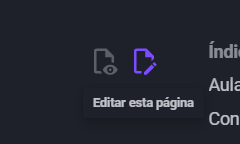

# Como Funciona Este Guia?

Este guia tem como objetivo ensinar os principais tópicos de programação competitiva. Cada seção aborda um assunto específico e algumas podem ter subtópicos para maior detalhamento.

---

## Padrão de Escrita

Cada seção é escrita pelos alunos participantes do **Monkeys UFG**.

Geralmente, disponibilizamos uma videoaula relacionada ao tópico atual para aqueles que preferem aprender de forma visual.

Toda seção começa com um **problema motivador** (há exceções). É muito importante que você tente resolver o problema antes de continuar a leitura da seção. Durante a explicação, o autor detalhará o conceito por trás do problema e, em seguida, apresentará a solução para o problema motivador.

No final de cada seção, você encontrará uma lista de exercícios preparada pelo autor, relacionada ao tópico abordado. Ela não segue uma ordem específica, e é fundamental que você faça os exercícios para fixar o aprendizado.

Em caso de dúvidas sobre os problemas ou qualquer outro assunto relacionado ao tópico, você pode nos encontrar no **laboratório 252 do INF/UFG** ou tirar dúvidas online via <a href="https://discord.gg/fVy39w4nNv" target="_blank">Discord</a>.

---

## Sobre a Ordem de Leitura

O guia não exige uma ordem específica de leitura. Se você já domina algum dos conteúdos, sinta-se à vontade para pular.

A ordem atual no site é a que acreditamos seguir um padrão de crescimento de dificuldade satisfatório.

---

## Contribuir para o Site

Se você encontrou algum erro durante sua leitura ou deseja fazer alguma sugestão de conteúdo, pode visitar nosso <a href="https://github.com/Monkeys-UFG/website" target="_blank">repositório no GitHub</a>.

Em cada seção, há botões para visualização do código da página e a opção para contribuir.

O site ainda não está completo; adicionaremos mais tópicos com o tempo. Boa leitura!